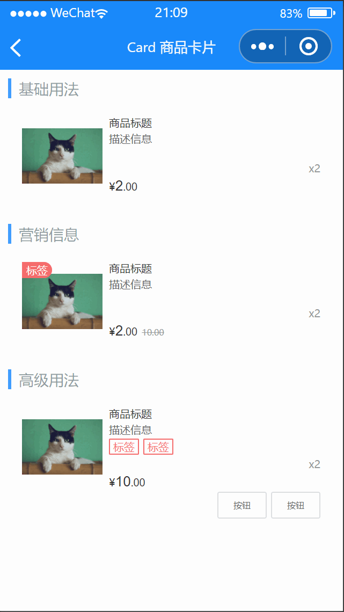

# Card 商品卡片

---

 <div class="demo-outer-container">
     <div class="demo-inner-container">
        <div class="demo-content">
            
        </div>
     </div>
 </div>

## 引入

在 app.json 或 index.json 中引入组件，详细介绍见[快速上手](/#/start)

```json
"usingComponents": {
   "lin-card": "/dist/Card/index"
}
```

## 基础用法

:::demo

```html
<lin-card
  num="2"
  price="2.00"
  desc="描述信息"
  title="商品标题"
  thumb="/images/cat.png"
/>
```

:::

## 营销信息

:::demo

```html
<lin-card
  tag="标签"
  origin-price="10.00"
  num="2"
  price="2.00"
  desc="描述信息"
  title="商品标题"
  thumb="/images/cat.png"
/>
```

:::

## 高级用法

:::demo

```html
<lin-card
  num="2"
  price="10.00"
  desc="描述信息"
  title="商品标题"
  thumb="/images/cat.png"
>
  <view slot="tags">
    <lin-tag style="margin-right:10rpx" plain type="danger">标签</lin-tag>
    <lin-tag plain type="danger">标签</lin-tag>
  </view>
  <view slot="footer" class="footer">
    <lin-button style="margin-right:10rpx" size="small">按钮</lin-button>
    <lin-button size="small">按钮</lin-button>
  </view>
</lin-card>
```

:::

## 属性

| 参数        | 说明                                                              | 类型           | 可选值                                              | 默认值     |
| ----------- | ----------------------------------------------------------------- | -------------- | --------------------------------------------------- | ---------- |
| thumb       | 左侧图片                                                          | String         | —                                                   | —          |
| thumbMode   | 左侧图片裁剪、缩放的模式，可选值参考小程序 image 组件 mode 属性值 | String         | —                                                   | aspectFit  |
| title       | 标题                                                              | String         | —                                                   | —          |
| desc        | 描述                                                              | String         | —                                                   | —          |
| tag         | 标签                                                              | String         | —                                                   | —          |
| num         | 商品数量                                                          | String, Number | —                                                   | —          |
| price       | 商品价格                                                          | String, Number | —                                                   | —          |
| originPrice | 商品划线原价                                                      | String, Number | —                                                   | —          |
| currency    | 货币符号                                                          | String         | —                                                   | ¥          |
| thumbLink   | 点击左侧图片后跳转的链接地址                                      | String         | —                                                   | —          |
| lazyLoad    | 是否开启图片懒加载                                                | Boolean        | —                                                   | false      |
| linkType    | 链接跳转类型                                                      | String         | `navigateTo`, `redirectTo`, `switchTab`, `reLaunch` | navigateTo |

## 插槽

| 插槽名称     | 说明                                                 |
| ------------ | ---------------------------------------------------- |
| tag          | 自定义图片角标，如果设置了`tag`属性则不生效          |
| thumb        | 自定义图片，如果设置了`thumb`属性则不生效            |
| title        | 自定义标题栏，如果设置了`title`属性则不生效          |
| desc         | 自定义描述栏，如果设置了`desc`属性则不生效           |
| tags         | 自定义描述下方标签区域                               |
| price-top    | 自定义价格上方区域                                   |
| price        | 自定义价格                                           |
| origin-price | 自定义商品原价，如果设置了`origin-price`属性则不生效 |
| num          | 自定义数量                                           |
| price-bottom | 自定义价格下方区域                                   |
| footer       | 自定义右下角内容                                     |

## 外部样式类

| 类名           | 说明           |
| ------------------ | -------------- |
| custom-class       | 根节点样式类   |
| thumb-class        | 图片容器样式类 |
| tag-class          | 角标样式类     |
| image-class        | 图片样式类     |
| content-class      | 内容样式类     |
| title-class        | 标题样式类     |
| desc-class         | 描述样式类     |
| price-class        | 价格样式类     |
| currency-class     | 货币样式类     |
| integer-class      | 整数样式类     |
| decimal-class      | 小数样式类     |
| origin-price-class | 划线原价样式类     |
| num-class          | 数量样式类     |
