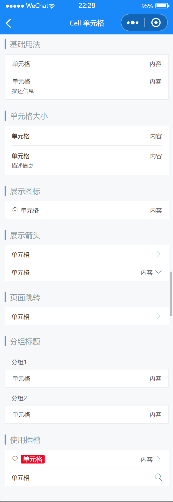

# Cell 单元格

---

 <div class="demo-outer-container">
     <div class="demo-inner-container">
        <div class="demo-content">
            
        </div>
     </div>
 </div>

## 引入

在 app.json 或 index.json 中引入组件，详细介绍见[快速上手](/#/start)

```json
"usingComponents": {
  "lin-cell-group": "/dist/CellGroup/index",
  "lin-cell": "/dist/Cell/index"
}
```

## 基本用法

`Cell`可以单独使用，也可以与`CellGroup`搭配使用。`CellGroup`可以为`Cell`提供上下外边框。

:::demo

```html
<lin-cell-group>
  <lin-cell title="单元格" value="内容" />
  <lin-cell title="单元格" value="内容" label="描述信息" border="{ { false }}" />
</lin-cell-group>
```

:::

## 单元格大小

通过`size`属性可以控制单元格的大小

:::demo

```html
<lin-cell title="单元格" value="内容" size="large" />
<lin-cell
  title="单元格"
  value="内容"
  size="large"
  label="描述信息"
  border="{ { false }}"
/>
```

:::

## 展示图标

通过`icon`属性在标题左侧展示图标
:::demo

```html
<lin-cell title="单元格" value="内容" icon="upload" border="{ { false }}" />
```

:::

## 展示箭头

设置`is-link`属性后会在单元格右侧显示箭头，并且可以通过`arrow-direction`属性控制箭头方向

:::demo

```html
<lin-cell title="单元格" is-link />
<lin-cell title="单元格" is-link value="内容" />
<lin-cell
  title="单元格"
  is-link
  value="内容"
  arrow-direction="down"
  border="{ { false }}"
/>
```

:::

## 页面跳转

设置`link-type`属性指定跳转方式，设置`url`属性指定跳转的页面

:::demo

```html
<lin-cell
  is-link
  title="单元格"
  link-type="navigateTo"
  url="/pages/component/button/index"
  border="{ { false }}"
/>
```

:::

## 分组标题

通过`CellGroup`的`title`属性可以指定分组标题

:::demo

```html
<lin-cell-group title="分组1">
  <lin-cell title="单元格" value="内容" />
</lin-cell-group>
<lin-cell-group title="分组2">
  <lin-cell title="单元格" value="内容" />
</lin-cell-group>
```

:::

## 使用插槽

如以上用法不能满足你的需求，可以使用插槽来自定义内容

:::demo

```html
<lin-cell value="内容" icon="like" is-link>
  <view slot="title">
    <view class="cell-text">单元格</view>
  </view>
</lin-cell>
<lin-cell title="单元格" border="{ { false }}">
  <lin-icon slot="right-icon" icon="search" />
</lin-cell>
```

```css
.cell-text{
  background-color: #ee0a24;
  padding: 0 4px;
  color: #fff;
  font-size: 12px;
  line-height: 16px;
  border-radius: 2px;
}
```

:::

## CellGroup 属性

| 参数   | 说明           | 类型    | 可选值 | 默认值 |
| ------ | -------------- | ------- | ------ | ------ |
| title  | 分组标题       | String  | —      | —      |
| border | 是否显示外边框 | Boolean | —      | true   |

## CellGroup 外部样式类

| 类名     | 说明         |
| ------------ | ------------ |
| custom-class | 根节点样式类 |
| title-class  | 标题样式类   |

## Cell 属性

| 参数           | 说明                 | 类型           | 可选值                                              | 默认值     |
| -------------- | -------------------- | -------------- | --------------------------------------------------- | ---------- |
| title          | 左侧标题             | String         | —                                                   | —          |
| value          | 右侧内容             | String         | —                                                   | —          |
| label          | 标题下方的描述信息   | String         | —                                                   | —          |
| border         | 是否显示下边框       | Boolean        | —                                                   | true       |
| size           | 单元格大小           | String         | `large`                                             | —          |
| icon           | 左侧图标             | String         | —                                                   | —          |
| isLink         | 是否展示右侧箭头     | Boolean        | —                                                   | false      |
| required       | 是否显示表单必填星号 | Boolean        | —                                                   | false      |
| arrowDirection | 箭头方向             | String         | `up`, `down`, `right`, `left`                       | right      |
| url            | 点击后跳转的链接地址 | String         | —                                                   | —          |
| titleWidth     | 标题宽度             | String, Number | —                                                   | —          |
| customStyle    | 根节点样式           | String         | —                                                   | —          |
| linkType       | 链接跳转类型         | String         | `navigateTo`, `redirectTo`, `switchTab`, `reLaunch` | navigateTo |

## Cell 事件

| 事件名     | 说明             | 参数  |
| ---------- | ---------------- | ----- |
| bind:click | 点击单元格时触发 | event |

## Cell 插槽

| 插槽名称   | 说明                                                           |
| ---------- | -------------------------------------------------------------- |
| icon       | 自定义`icon`显示内容，如果设置了`icon`属性则不生效             |
| title      | 自定义`title`显示内容，如果设置了`title`属性则不生效           |
| value      | 自定义`value`显示内容，如果设置了`value`属性则不生效           |
| right-icon | 自定义右侧按钮，默认是`arrow`，如果设置了`is-link`属性则不生效 |
| label      | 自定义`label`显示内容，如果设置了`label`属性则不生效           |

## Cell 外部样式类

| 类名         | 说明           |
| ---------------- | -------------- |
| custom-class     | 根节点样式类   |
| title-class      | 标题样式类     |
| value-class      | 右侧内容样式类 |
| label-class      | 描述信息样式类 |
| header-class     | 头部样式类     |
| right-icon-class | 右侧图标样式类 |
