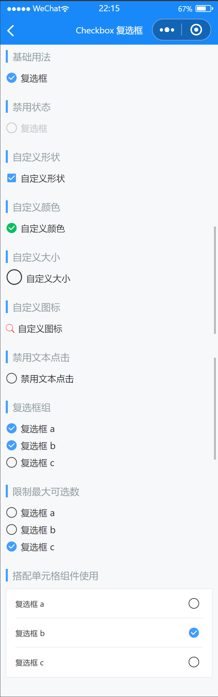

# Checkbox 复选框

---

 <div class="demo-outer-container">
     <div class="demo-inner-container">
        <div class="demo-content">
            
        </div>
     </div>
 </div>

## 引入

在 app.json 或 index.json 中引入组件，详细介绍见[快速上手](/#/start)

```json
"usingComponents": {
  "lin-checkbox": "/dist/Checkbox/index",
  "lin-checkbox-group": "/dist/CheckboxGroup/index"
}
```

## 基础用法

通过`value`绑定复选框的勾选状态

```html
<lin-checkbox data-key="checked1" value="{{ checked1 }}" bind:change="onChange"
  >复选框</lin-checkbox
>
```

```javascript
Page({
  data: {
    checked1: false,
  },
  onChange(event) {
    const key = event.currentTarget.dataset.key;
    this.setData({
      [key]: event.detail,
    });
  },
});
```

## 禁用状态

通过设置`disabled`属性可以禁用复选框

```html
<lin-checkbox
  data-key="checked2"
  disabled
  value="{{ checked2 }}"
  bind:change="onChange"
  >复选框</lin-checkbox
>
```

## 自定义形状

将`shape`属性设置为`square`，复选框的形状会变成方形

```html
<lin-checkbox
  data-key="checked3"
  shape="square"
  value="{{ checked3 }}"
  bind:change="onChange"
  >自定义形状</lin-checkbox
>
```

## 自定义颜色

通过`checked-color`属性可以自定义选中状态下的图标颜色

```html
<lin-checkbox
  data-key="checked4"
  value="{{ checked4 }}"
  checked-color="#07c160"
  bind:change="onChange"
>
  自定义颜色
</lin-checkbox>
```

## 自定义大小

通过`icon-size`属性可以自定义图标的大小

```html
<lin-checkbox
  data-key="checked5"
  value="{{ checked5 }}"
  icon-size="25px"
  bind:change="onChange"
>
  自定义大小
</lin-checkbox>
```

## 自定义图标

将`shape`属性设置为`square`，复选框的形状会变成方形

```html
<lin-checkbox
  use-icon-slot
  data-key="checked6"
  value="{{ checked6 }}"
  bind:change="onChange"
>
  <lin-icon icon="search" slot="icon" color="{{checked6?'red':''}}" />
  自定义图标
</lin-checkbox>
```

## 禁用文本点击

通过设置`label-disabled`属性可以禁用复选框文本点击

```html
<lin-checkbox
  label-disabled
  data-key="checked7"
  value="{{ checked7 }}"
  bind:change="onChange"
>
  禁用文本点击
</lin-checkbox>
```

## 复选框组

需要与`lin-checkbox-group`一起使用，选中值是一个数组，通过`value`绑定在`lin-checkbox-group`上，数组中的项即为选中的`Checkbox`的`name`属性设置的值

```html
<lin-checkbox-group
  data-key="result1"
  value="{{ result1 }}"
  bind:change="onGroupChange"
>
  <lin-checkbox name="a">复选框 a</lin-checkbox>
  <lin-checkbox name="b">复选框 b</lin-checkbox>
  <lin-checkbox name="c">复选框 c</lin-checkbox>
</lin-checkbox-group>
```

```javascript
Page({
  data: {
    result1: [],
  },
  onGroupChange(event) {
    const key = event.currentTarget.dataset.key;
    this.setData({
      [key]: event.detail,
    });
  },
});
```

## 限制最大可选数

通过设置`max`属性可以限制最大可选数

```html
<lin-checkbox-group
  data-key="result2"
  value="{{ result2 }}"
  bind:change="onGroupChange"
  max="{{ 2 }}"
>
  <lin-checkbox name="a">复选框 a</lin-checkbox>
  <lin-checkbox name="b">复选框 b</lin-checkbox>
  <lin-checkbox name="c">复选框 c</lin-checkbox>
</lin-checkbox-group>
```

## 搭配单元格组件使用

此时你需要再引入 Cell 和 CellGroup 组件，并通过 checkbox 的 toggle 方法手动触发切换

```html
<lin-checkbox-group
  data-key="result3"
  value="{{ result3 }}"
  bind:change="onGroupChange"
>
  <lin-cell-group>
    <lin-cell
      wx:for="{{ list }}"
      wx:key="index"
      title="复选框 {{ item }}"
      data-index="{{ index }}"
      bind:click="toggle"
    >
      <lin-checkbox
        slot="right-icon"
        class="checkboxes-{{ index }}"
        catch:tap="noop"
        name="{{ item }}"
      />
    </lin-cell>
  </lin-cell-group>
</lin-checkbox-group>
```

```javascript
Page({
  data: {
    result3: [],
    list: ["a", "b", "c"],
  },
  toggle(event) {
    const { index } = event.currentTarget.dataset;
    const checkbox = this.selectComponent(`.checkboxes-${index}`);
    checkbox.toggle();
  },
});
```

## Checkbox 属性

| 参数          | 说明                   | 类型           | 可选值            | 默认值 |
| ------------- | ---------------------- | -------------- | ----------------- | ------ |
| value         | 是否为选中状态         | Boolean        | —                 | false  |
| disabled      | 是否禁用单选框         | Boolean        | —                 | false  |
| shape         | 形状                   | String         | `round`, `square` | round  |
| checkedColor  | 选中状态颜色           | String         | —                 | —      |
| iconSize      | icon 图标大小          | String, Number | —                 | 40rpx  |
| useIconSlot   | 是否使用 icon slot     | Boolean        | —                 | false  |
| labelDisabled | 是否禁用单选框内容点击 | Boolean        | —                 | false  |
| name          | 标识 Checkbox 名称     | String         | —                 | —      |

## Checkbox 事件

| 事件名      | 说明                     | 参数  |
| ----------- | ------------------------ | ----- |
| bind:change | 当绑定值变化时触发的事件 | event |

## Checkbox 插槽

| 插槽名称 | 说明       |
| -------- | ---------- |
| —        | 自定义文本 |
| icon     | 自定义图标 |


## Checkbox 外部样式类

| 插槽名称 | 说明       |
| -------- | ---------- |
| custom-class        | 	根节点样式类 |
| icon-class     | 图标样式类 |
| label-class     | 描述信息样式类 |

## Checkbox 方法

| 方法名       | 参数 | 返回值 | 介绍         |
| ------------ | ---- | ------ | ------------ |
| toggle | —    | —      | 切换选中状态 |

## CheckboxGroup 属性

| 参数      | 说明                   | 类型            | 可选值 | 默认值 |
| --------- | ---------------------- | --------------- | ------ | ------ |
| value     | 所有选中项的 name      | Array           | —      | —      |
| disabled  | 是否禁用所有单选框     | Boolean         | —      | false  |
| max       | 设置最大可选数         | Number          | —      | —      |
| name      | 在表单内提交时的标识符 | String          | —      | —      |
| direction | 选项排版方向           | `column`, `row` | —      | column |

## CheckboxGroup 事件

| 事件名      | 说明                     | 参数  |
| ----------- | ------------------------ | ----- |
| bind:change | 当绑定值变化时触发的事件 | event |

## CheckboxGroup 外部样式类

| 插槽名称     | 说明         |
| ------------ | ------------ |
| custom-class | 根节点样式类 |
