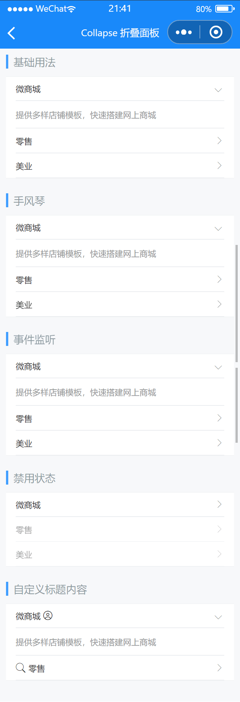

# Collapse 折叠面板

---

 <div class="demo-outer-container">
     <div class="demo-inner-container">
        <div class="demo-content">
            
        </div>
     </div>
 </div>

## 引入

在 app.json 或 index.json 中引入组件，详细介绍见[快速上手](/#/start)

```json
"usingComponents": {
  "lin-collapse": "/dist/Collapse/index",
  "lin-collapse-item": "/dist/CollapseItem/index"
}
```

## 基础用法

通过`value`控制展开的面板列表，`activeNames`为数组格式

:::demo

```html
<lin-collapse
  data-key="activeNames1"
  value="{ { activeNames1 }}"
  bind:change="onChange"
>
  <lin-collapse-item title="微商城" name="1">
    提供多样店铺模板，快速搭建网上商城
  </lin-collapse-item>
  <lin-collapse-item title="零售" name="2">
    网店吸粉获客、会员分层营销、一机多种收款，告别经营低效和客户流失
  </lin-collapse-item>
  <lin-collapse-item title="美业" name="3">
    线上拓客，随时预约，贴心顺手的开单收银
  </lin-collapse-item>
</lin-collapse>
```

```javascript
Page({
  data: {
    activeNames1: ["1"],
  },
  onChange(event) {
    const { key } = event.currentTarget.dataset;

    this.setData({
      [key]: event.detail,
    });
  },
});
```

:::

## 手风琴

通过`accordion`可以设置为手风琴模式，最多展开一个面板，此时`activeName`为字符串格式

:::demo

```html
<lin-collapse
  accordion
  data-key="activeNames2"
  value="{ { activeNames2 }}"
  bind:change="onChange"
>
  <lin-collapse-item title="微商城" name="1">
    提供多样店铺模板，快速搭建网上商城
  </lin-collapse-item>
  <lin-collapse-item title="零售" name="2">
    网店吸粉获客、会员分层营销、一机多种收款，告别经营低效和客户流失
  </lin-collapse-item>
  <lin-collapse-item title="美业" name="3">
    线上拓客，随时预约，贴心顺手的开单收银
  </lin-collapse-item>
</lin-collapse>
```

```javascript
Page({
  data: {
    activeNames2: "1",
  },
  onChange(event) {
    const { key } = event.currentTarget.dataset;

    this.setData({
      [key]: event.detail,
    });
  },
});
```

:::

## 事件监听

`lin-collapse` 提供了 `change`, `open` 和 `close` 事件。`change` 事件在面板切换时触发，`open` 事件在面板展开时触发，`close` 事件在面板关闭时触发。

:::demo

```html
<lin-collapse
  data-key="activeNames3"
  value="{ { activeNames3 }}"
  bind:change="onChange"
  bind:open="onOpen"
  bind:close="onClose"
>
  <lin-collapse-item title="微商城" name="1">
    提供多样店铺模板，快速搭建网上商城
  </lin-collapse-item>
  <lin-collapse-item title="零售" name="2">
    网店吸粉获客、会员分层营销、一机多种收款，告别经营低效和客户流失
  </lin-collapse-item>
  <lin-collapse-item title="美业" name="3">
    线上拓客，随时预约，贴心顺手的开单收银
  </lin-collapse-item>
</lin-collapse>
```

```javascript
Page({
  data: {
    activeNames3: ["1"],
  },
  onChange(event) {
    const { key } = event.currentTarget.dataset;

    this.setData({
      [key]: event.detail,
    });
  },
  onOpen(event) {
    wx.showToast({
      title: `展开: ${event.detail}`,
      icon: "none",
    });
  },
  onClose(event) {
    wx.showToast({
      title: `关闭: ${event.detail}`,
      icon: "none",
    });
  },
});
```

:::

## 禁用状态

通过`disabled`属性设置为禁用状态

:::demo

```html
<lin-collapse
  data-key="activeNames4"
  value="{ { activeNames4 }}"
  bind:change="onChange"
>
  <lin-collapse-item title="微商城" name="1">
    提供多样店铺模板，快速搭建网上商城
  </lin-collapse-item>
  <lin-collapse-item disabled title="零售" name="2">
    网店吸粉获客、会员分层营销、一机多种收款，告别经营低效和客户流失
  </lin-collapse-item>
  <lin-collapse-item disabled title="美业" name="3">
    线上拓客，随时预约，贴心顺手的开单收银
  </lin-collapse-item>
</lin-collapse>
```

```javascript
Page({
  data: {
    activeNames4: [],
  },
  onChange(event) {
    const { key } = event.currentTarget.dataset;

    this.setData({
      [key]: event.detail,
    });
  },
});
```

:::

## 自定义标题内容

通过`title`插槽可自定义标题内容

:::demo

```html
<lin-collapse
  data-key="activeNames5"
  value="{ { activeNames5 }}"
  bind:change="onChange"
>
  <lin-collapse-item name="1">
    <view slot="title">
      微商城
      <lin-icon icon="user" />
    </view>
    提供多样店铺模板，快速搭建网上商城
  </lin-collapse-item>
  <lin-collapse-item title="零售" name="2" icon="search">
    网店吸粉获客、会员分层营销、一机多种收款，告别经营低效和客户流失
  </lin-collapse-item>
</lin-collapse>
```

```javascript
Page({
  data: {
    activeNames5: ["1"],
  },
  onChange(event) {
    const { key } = event.currentTarget.dataset;

    this.setData({
      [key]: event.detail,
    });
  },
});
```

:::

## Collapse 属性

| 参数      | 说明                | 类型                                                          | 可选值 | 默认值 |
| --------- | ------------------- | ------------------------------------------------------------- | ------ | ------ |
| value     | 当前展开面板的 name | 非手风琴模式：(string &#124; number)[]<br/>手风琴模式：string | —      | —      |
| accordion | 是否开启手风琴模式  | Boolean                                                       | —      | false  |
| border    | 是否显示外边框      | Boolean                                                       | —      | true   |

## Collapse 事件

| 事件名      | 说明           | 参数                |
| ----------- | -------------- | ------------------- |
| bind:open   | 展开面板时触发 | 当前打开面板的 name |
| bind:close  | 关闭面板时触发 | 当前关闭面板的 name |
| bind:change | 切换面板时触发 | 当前激活面板的 name |

## Collapse 外部样式类

| 插槽名称     | 说明         |
| ------------ | ------------ |
| custom-class | 根节点样式类 |

## CollapseItem 属性

| 参数     | 说明                                 | 类型    | 可选值 | 默认值 |
| -------- | ------------------------------------ | ------- | ------ | ------ |
| name     | 唯一标识符，默认为索引值             | any     | —      | index  |
| title    | 标题栏左侧内容                       | any     | —      | —      |
| value    | 标题栏右侧内容                       | any     | —      | —      |
| icon     | 标题栏左侧图标名称                   | String  | —      | —      |
| label    | 标题栏描述信息                       | String  | —      | —      |
| disabled | 是否禁用面板                         | Boolean | —      | false  |
| border   | 是否显示内边框                       | Boolean | —      | true   |
| isLink   | 是否展示标题栏右侧箭头并开启点击反馈 | Boolean | —      | true   |

## CollapseItem 插槽

| 插槽名称   | 说明           |
| ---------- | -------------- |
| —          | 面板内容       |
| title      | 自定义标题     |
| icon       | 自定义图标     |
| value      | 自定义显示内容 |
| right-icon | 自定义右侧图标 |

## CollapseItem 外部样式类

| 插槽名称      | 说明         |
| ------------- | ------------ |
| custom-class  | 根节点样式类 |
| content-class | 内容样式类   |
