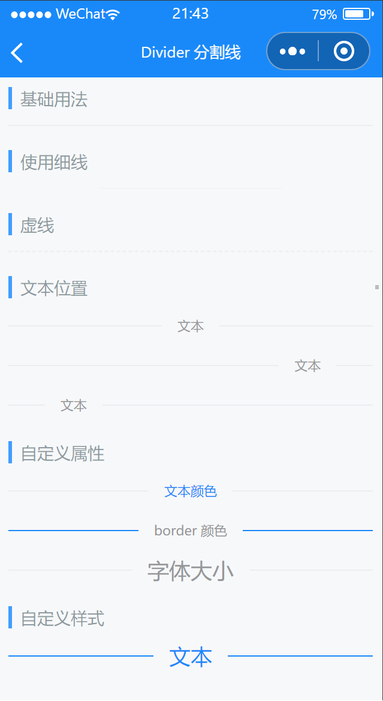

# Divider 分割线

---

 <div class="demo-outer-container">
     <div class="demo-inner-container">
        <div class="demo-content">
            
        </div>
     </div>
 </div>

## 引入

在 app.json 或 index.json 中引入组件，详细介绍见[快速上手](/#/start)

```json
"usingComponents": {
  "lin-divider": "/dist/Divider/index"
}
```

## 基础用法

:::demo

```html
<lin-divider />
```

:::

## 使用细线

通过`hairline`属性设置细线

:::demo

```html
<lin-divider hairline />
```

:::

## 虚线

通过`dashed`属性设置虚线

:::demo

```html
<lin-divider dashed />
```

:::

## 文本位置

通过`contentPosition`属性设置文本位置

:::demo

```html
<lin-divider contentPosition="center">文本</lin-divider>
<lin-divider contentPosition="left">文本</lin-divider>
<lin-divider contentPosition="right">文本</lin-divider>
```

:::

## 自定义属性

自定义属性有`textColor`,`borderColor`和`fontSize`等

:::demo

```html
<lin-divider contentPosition="center" textColor="#1989fa">文本颜色</lin-divider>
<lin-divider contentPosition="center" borderColor="#1989fa">
  border 颜色
</lin-divider>
<lin-divider contentPosition="center" fontSize="18px">
  字体大小
</lin-divider>
```

:::

## 自定义样式

通过`customStyle`属性，自定义样式

:::demo

```html
<lin-divider
  contentPosition="center"
  customStyle="color: #1989fa; border-color: #1989fa; font-size: 18px;"
>
  文本
</lin-divider>
```

:::

## 属性

| 参数            | 说明       | 类型           | 可选值                    | 默认值 |
| --------------- | ---------- | -------------- | ------------------------- | ------ |
| dashed          | 虚线       | Boolean        | —                         | false  |
| hairline        | 细线       | Boolean        | —                         | false  |
| contentPosition | 文本位置   | String         | `left`, `center`, `right` | —      |
| fontSize        | 字体大小   | String, Number | —                         | —      |
| borderColor     | 线条颜色   | String         | —                         | —      |
| textColor       | 文本颜色   | String         | —                         | —      |
| customStyle     | 根节点样式 | String         | —                         | —      |

## 外部样式类

| 类名     | 说明         |
| ------------ | ------------ |
| custom-class | 根节点样式类 |
