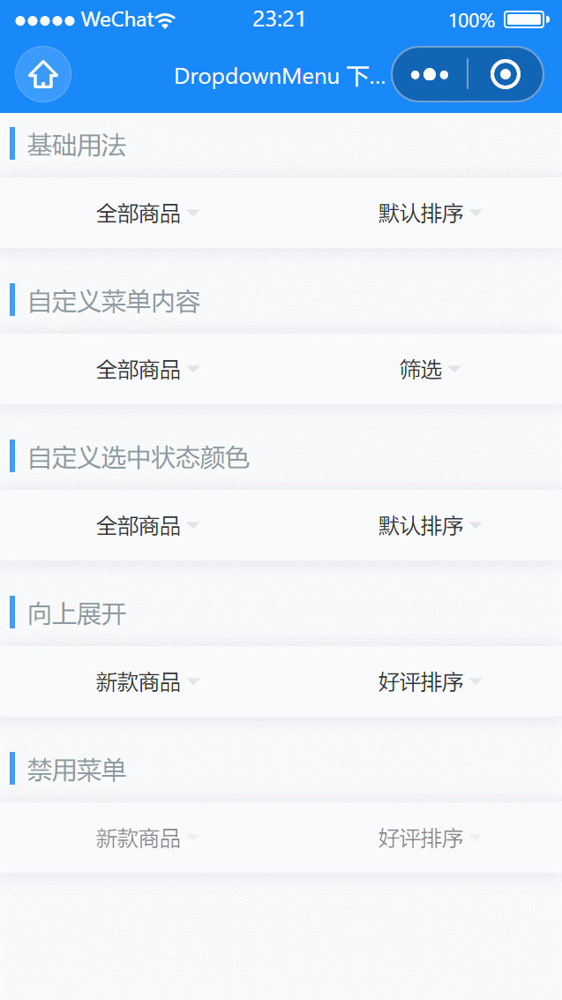

# DropdownMenu 下拉菜单

---

 <div class="demo-outer-container">
     <div class="demo-inner-container">
        <div class="demo-content">
            
        </div>
     </div>
 </div>

## 引入

在 app.json 或 index.json 中引入组件，详细介绍见[快速上手](/#/start)

```json
"usingComponents": {
  "lin-dropdown-menu": "/dist/DropdownMenu/index",
  "lin-dropdown-item": "/dist/DropdownItem/index"
}
```

## 基础用法

:::demo

```html
<lin-dropdown-menu zIndex="20">
  <lin-dropdown-item
    bind:change="onChange"
    data-key="value1"
    value="{ { value1 }}"
    options="{ { option1 }}"
  />
  <lin-dropdown-item
    bind:change="onChange"
    data-key="value2"
    value="{ { value2 }}"
    options="{ { option2 }}"
  />
</lin-dropdown-menu>
```

```javascript
Page({
  data: {
    option1: [
      {
        text: "全部商品",
        value: 0,
      },
      {
        text: "新款商品",
        value: 1,
      },
      {
        text: "活动商品",
        value: 2,
      },
    ],
    option2: [
      {
        text: "默认排序",
        value: "a",
      },
      {
        text: "好评排序",
        value: "b",
      },
      {
        text: "销量排序",
        value: "c",
      },
    ],
    value1: 0,
    value2: "a",
  },
  onChange(event) {
    const key = event.currentTarget.dataset.key;
    this.setData({
      [key]: event.detail,
    });
  },
});
```

:::

## 自定义菜单内容

:::demo

```html
<lin-dropdown-menu zIndex="20">
  <lin-dropdown-item
    bind:change="onChange"
    data-key="value3"
    value="{ { value3 }}"
    options="{ { option3 }}"
  />
  <lin-dropdown-item id="item" title="{ { itemTitle }}">
    <lin-cell title="{ { switchTitle1 }}">
      <lin-switch
        slot="right-icon"
        size="24px"
        style="height: 26px"
        checked="{ { switch1 }}"
        data-key="switch1"
        active-color="#ee0a24"
        bind:change="onSwitchChange"
      />
    </lin-cell>
    <lin-cell title="{ { switchTitle2 }}">
      <lin-switch
        data-key="switch2"
        slot="right-icon"
        size="24px"
        style="height: 26px"
        checked="{ { switch2 }}"
        active-color="#ee0a24"
        bind:change="onSwitchChange"
      />
    </lin-cell>
    <view style="padding: 5px 16px;">
      <lin-button type="danger" block round bind:click="onConfirm">
        确认
      </lin-button>
    </view>
  </lin-dropdown-item>
</lin-dropdown-menu>
```

```javascript
Page({
  data: {
    option3: [
      {
        text: "全部商品",
        value: 0,
      },
      {
        text: "新款商品",
        value: 1,
      },
      {
        text: "活动商品",
        value: 2,
      },
    ],
    switchTitle1: "包邮",
    switchTitle2: "团购",
    itemTitle: "筛选",
    switch1: false,
    switch2: false,
  },
  onChange(event) {
    const key = event.currentTarget.dataset.key;
    this.setData({
      [key]: event.detail,
    });
  },
  onSwitchChange(event) {
    const key = event.currentTarget.dataset.key;
    this.setData({
      [key]: event.detail,
    });
  },
  onConfirm() {
    this.selectComponent("#item").toggle();
  },
});
```

:::

## 自定义选中状态颜色

通过`active-color`属性自定义选中状态颜色

:::demo

```html
<lin-dropdown-menu active-color="#1989fa" zIndex="20">
  <lin-dropdown-item
    bind:change="onChange"
    data-key="value4"
    value="{ { value4 }}"
    options="{ { option1 }}"
  />
  <lin-dropdown-item
    bind:change="onChange"
    data-key="value5"
    value="{ { value5 }}"
    options="{ { option2 }}"
  />
</lin-dropdown-menu>
```

```javascript
Page({
  data: {
    option1: [
      {
        text: "全部商品",
        value: 0,
      },
      {
        text: "新款商品",
        value: 1,
      },
      {
        text: "活动商品",
        value: 2,
      },
    ],
    option2: [
      {
        text: "默认排序",
        value: "a",
      },
      {
        text: "好评排序",
        value: "b",
      },
      {
        text: "销量排序",
        value: "c",
      },
    ],
    value4: 0,
    value5: "a",
  },
  onChange(event) {
    const key = event.currentTarget.dataset.key;
    this.setData({
      [key]: event.detail,
    });
  },
});
```

:::

## 向上展开

通过`direction`属性控制展开方向

:::demo

```html
<lin-dropdown-menu direction="up" zIndex="20">
  <lin-dropdown-item
    bind:change="onChange"
    data-key="value6"
    value="{ { value6 }}"
    options="{ { option1 }}"
  />
  <lin-dropdown-item
    bind:change="onChange"
    data-key="value7"
    value="{ { value7 }}"
    options="{ { option2 }}"
  />
</lin-dropdown-menu>
```

```javascript
Page({
  data: {
    option1: [
      {
        text: "全部商品",
        value: 0,
      },
      {
        text: "新款商品",
        value: 1,
      },
      {
        text: "活动商品",
        value: 2,
      },
    ],
    option2: [
      {
        text: "默认排序",
        value: "a",
      },
      {
        text: "好评排序",
        value: "b",
      },
      {
        text: "销量排序",
        value: "c",
      },
    ],
    value6: 1,
    value7: "b",
  },
  onChange(event) {
    const key = event.currentTarget.dataset.key;
    this.setData({
      [key]: event.detail,
    });
  },
});
```

:::

## 禁用菜单

通过`disabled`属性设置菜单为禁用状态

:::demo

```html
<lin-dropdown-menu zIndex="20">
  <lin-dropdown-item
    bind:change="onChange"
    data-key="value8"
    disabled
    value="{ { value8 }}"
    options="{ { option1 }}"
  />
  <lin-dropdown-item
    bind:change="onChange"
    data-key="value9"
    disabled
    value="{ { value9 }}"
    options="{ { option2 }}"
  />
</lin-dropdown-menu>
```

```javascript
Page({
  data: {
    option1: [
      {
        text: "全部商品",
        value: 0,
      },
      {
        text: "新款商品",
        value: 1,
      },
      {
        text: "活动商品",
        value: 2,
      },
    ],
    option2: [
      {
        text: "默认排序",
        value: "a",
      },
      {
        text: "好评排序",
        value: "b",
      },
      {
        text: "销量排序",
        value: "c",
      },
    ],
    value8: 1,
    value9: "b",
  },
  onChange(event) {
    const key = event.currentTarget.dataset.key;
    this.setData({
      [key]: event.detail,
    });
  },
});
```

:::

## DropdownMenu 属性

| 参数                | 说明                           | 类型    | 可选值       | 默认值 |
| ------------------- | ------------------------------ | ------- | ------------ | ------ |
| activeColor         | 菜单标题和选项的选中态颜色     | String  | —            | —      |
| zIndex              | 菜单栏 z-index 层级            | Number  | —            | 10     |
| duration            | 动画时长，单位毫秒             | Number  | —            | 200    |
| direction           | 菜单展开方向                   | String  | `down`, `up` | down   |
| mask                | 是否显示遮罩层                 | Boolean | —            | true   |
| closeOnClickMask    | 是否在点击遮罩层后关闭菜单     | Boolean | —            | true   |
| closeOnClickOutside | 是否在点击外部 menu 后关闭菜单 | Boolean | —            | true   |

## DropdownMenu 外部样式类

| 插槽名称      | 说明         |
| ------------- | ------------ |
| custom-class  | 根节点样式类 |
| wrapper-class | 容器样式类   |
| item-class    | 标题样式类   |

## DropdownItem 属性

| 参数       | 说明                   | 类型    | 可选值 | 默认值 |
| ---------- | ---------------------- | ------- | ------ | ------ |
| value      | 当前选中项对应的 value | any     | —      | —      |
| title      | 菜单项标题             | String  | —      | —      |
| options    | 选项数组               | Array   | —      | —      |
| disabled   | 是否禁用菜单           | Boolean | —      | false  |
| titleClass | 标题额外类名           | String  | —      | —      |
| popupStyle | 自定义弹出层样式       | String  | —      | —      |

## DropdownItem 事件

| 事件名       | 说明                          | 参数  |
| ------------ | ----------------------------- | ----- |
| bind:close   | 关闭菜单栏时触发              | —     |
| bind:change  | 点击选项导致 value 变化时触发 | value |
| bind:open    | 打开菜单栏时触发              | —     |
| bind:opended | 打开菜单栏且动画结束后触发    | —     |
| bind:closed  | 关闭菜单栏且动画结束后触发    | —     |

## DropdownItem 方法

| 方法名      | 说明                                                         | 参数           | 返回值 |
| ----------- | ------------------------------------------------------------ | -------------- | ------ |
| bind:toggle | 切换菜单展示状态，传 true 为显示，false 为隐藏，不传参为取反 | show?: boolean | —      |

## DropdownItem 外部样式类

| 插槽名称     | 说明         |
| ------------ | ------------ |
| custom-class | 根节点样式类 |
| item-class   | 选项样式类   |

## Option 数据结构

| 键名     | 说明         | 类型    |
| -------- | ------------ | ------- |
| text     | 文字         | String  |
| value    | 标识符       | any     |
| icon     | 右侧图标名称 | String  |
| disabled | 是否禁用     | Boolean |
