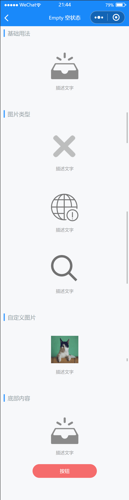

# Empty 空状态

---

 <div class="demo-outer-container">
     <div class="demo-inner-container">
        <div class="demo-content">
            
        </div>
     </div>
 </div>

## 引入

在 app.json 或 index.json 中引入组件，详细介绍见[快速上手](/#/start)

```json
"usingComponents": {
  "lin-empty": "/dist/Empty/index"
}
```

## 基础用法

:::demo

```html
<lin-empty description="描述文字" />
```

:::

## 图片类型

`Empty` 组件内置了多种占位图片类型，可以在不同业务场景下使用

:::demo

```html
<!-- 通用错误 -->
<lin-empty type="error" description="描述文字" />
<!-- 网络错误 -->
<lin-empty type="network" description="描述文字" />
<!-- 搜索提示 -->
<lin-empty type="search" description="描述文字" />
```

:::

## 自定义图片

需要自定义图片时，可以在 image 属性中传入任意图片 URL

:::demo

```html
<lin-empty image="/images/cat.png" description="描述文字" />
```

:::

## 底部内容

通过默认插槽可以在 `Empty` 组件的下方插入内容

:::demo

```html
<lin-empty description="描述文字">
  <lin-button round type="danger" custom-class="bottom-button">按钮</lin-button>
</lin-empty>
```

```css
.bottom-button {
  width: 160px;
  height: 40px;
  text-align: center;
  justify-content: center;
}
```

:::

## 属性

| 参数         | 说明                 | 类型    | 可选值                                  | 默认值  |
| ------------ | -------------------- | ------- | --------------------------------------- | ------- |
| type         | 状态类型             | String  | `error`, `network`, `search`, `default` | default |
| image        | 图片地址             | String  | —                                       | —       |
| description  | 图片下方的描述文字   | String  | —                                       | —       |
| useImageSlot | 是否使用图片插槽     | Boolean | —                                       | false   |
| useDescSlot  | 是否使用描述文字插槽 | Boolean | —                                       | false   |

## 插槽

| 插槽名称    | 说明           |
| ----------- | -------------- |
| —           | 自定义底部内容 |
| image       | 自定义图片     |
| description | 自定义描述文字 |

## 外部样式类

| 类名            | 说明               |
| ------------------- | ------------------ |
| custom-class        | 根节点样式类       |
| image-wrapper-class | 图片包裹容器样式类 |
| image-class         | 图片样式类         |
| description-class   | 描述文字样式类     |
| bottom-class        | 底部样式类         |
