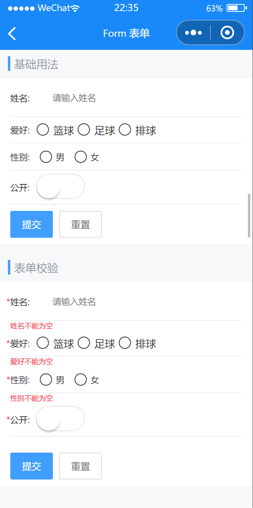

# Form 表单

---

 <div class="demo-outer-container">
     <div class="demo-inner-container">
        <div class="demo-content">
            
        </div>
     </div>
 </div>

## 引入

在 app.json 或 index.json 中引入组件，详细介绍见[快速上手](/#/start)

```json
"usingComponents": {
  "lin-form": "/dist/Form/index",
  "lin-form-item": "/dist/FormItem/index"
}
```

## 基础使用

在 `Form` 组件中，每一个表单域由一个 `FormItem` 组件构成，表单域中可以放置各种类型的表单控件。

:::demo

```html
<lin-form model="{ {student1}}">
  <lin-form-item label="姓名:">
    <lin-field
      bind:change="onChange"
      data-key="student1.name"
      placeholder="请输入姓名"
      titleWidth="0"
      border="{ {false}}"
      value="{ {student1.name}}"
    />
  </lin-form-item>
  <lin-form-item label="爱好:">
    <lin-checkbox-group
      direction="row"
      data-key="student1.hobby"
      value="{ { student1.hobby }}"
      bind:change="onChange"
    >
      <lin-checkbox style="margin-right:10rpx;" name="a">篮球</lin-checkbox>
      <lin-checkbox style="margin-right:10rpx;" name="b">足球</lin-checkbox>
      <lin-checkbox name="c">排球</lin-checkbox>
    </lin-checkbox-group>
  </lin-form-item>
  <lin-form-item label="性别:">
    <lin-radio-group
      direction="row"
      data-key="student1.sex"
      value="{ { student1.sex }}"
      bind:change="onChange"
    >
      <lin-radio style="margin-right:10rpx;" name="man">男</lin-radio>
      <lin-radio name="woman">女</lin-radio>
    </lin-radio-group>
  </lin-form-item>
  <lin-form-item label="公开:">
    <lin-switch
      data-key="student1.public"
      checked="{ { student1.public }}"
      bind:change="onChange"
    />
  </lin-form-item>
  <view slot="footer">
    <lin-button type="primary" bind:click="submit1">提交</lin-button>
    <lin-button style="margin-left:20rpx;" bind:click="reset1">重置</lin-button>
  </view>
</lin-form>
```

```javascript
Page({
  data: {
    student1: {
      name: "",
      hobby: [],
      sex: "",
      public: false,
    },
  },
  submit1() {
    wx.showToast({
      title: "提交",
      icon: "none",
    });
  },

  reset1() {
    wx.showToast({
      title: "重置",
      icon: "none",
    });
    this.setData({
      student1: {
        name: "",
        hobby: [],
        sex: "",
        public: false,
      },
    });
  },
  onChange(event) {
    const { key } = event.currentTarget.dataset;
    this.setData({
      [key]: event.detail,
    });
  },
});
```

:::

## 表单校验

`Form` 组件提供了表单验证的功能，只需要通过 `rules` 属性传入约定的验证规则，并将 `FormItem` 的 `name` 属性设置为需校验的字段名即可

:::demo

```html
<lin-form id="form" model="{ {student2}}" rules="{ {rules}}">
  <lin-form-item label="姓名:" name="name">
    <lin-field
      bind:change="onChange"
      data-key="student2.name"
      placeholder="请输入姓名"
      titleWidth="0"
      border="{ {false}}"
      value="{ {student2.name}}"
    />
  </lin-form-item>
  <lin-form-item label="爱好:" name="hobby">
    <lin-checkbox-group
      direction="row"
      data-key="student2.hobby"
      value="{ { student2.hobby }}"
      bind:change="onChange"
    >
      <lin-checkbox style="margin-right:10rpx;" name="a">篮球</lin-checkbox>
      <lin-checkbox style="margin-right:10rpx;" name="b">足球</lin-checkbox>
      <lin-checkbox name="c">排球</lin-checkbox>
    </lin-checkbox-group>
  </lin-form-item>
  <lin-form-item label="性别:" name="sex">
    <lin-radio-group
      direction="row"
      data-key="student2.sex"
      value="{ { student2.sex }}"
      bind:change="onChange"
    >
      <lin-radio style="margin-right:10rpx;" name="man">男</lin-radio>
      <lin-radio name="woman">女</lin-radio>
    </lin-radio-group>
  </lin-form-item>
  <lin-form-item label="公开:" name="public">
    <lin-switch
      data-key="student2.public"
      checked="{ { student2.public }}"
      bind:change="onChange"
    />
  </lin-form-item>
  <view slot="footer">
    <lin-button type="primary" bind:click="submit2">提交</lin-button>
    <lin-button style="margin-left:20rpx;" bind:click="reset2">重置</lin-button>
  </view>
</lin-form>
```

```javascript
Page({
  data: {
    student2: {
      name: "",
      hobby: [],
      sex: "",
      public: false,
    },
    rules: {
      name: [
        {
          required: true,
          message: "姓名不能为空",
          trigger: "blur",
        },
      ],
      hobby: [
        {
          required: true,
          message: "爱好不能为空",
          validator(rule, value, callback) {
            if (value.length === 0) {
              callback(new Error("爱好不能为空"));
            } else {
              callback();
            }
          },
        },
      ],
      sex: [
        {
          required: true,
          message: "性别不能为空",
        },
      ],
      public: [
        {
          required: true,
          message: "请选择是否公开",
        },
      ],
    },
  },
  submit2(event) {
    const $form = this.selectComponent("#form");
    $form.checkValue((flag) => {
      console.log(flag);
    });
  },
  reset2() {
    this.setData({
      student2: {
        name: "",
        hobby: [],
        sex: "",
        public: false,
      },
    });
  },
  onChange(event) {
    const { key } = event.currentTarget.dataset;
    this.setData({
      [key]: event.detail,
    });
  },
});
```

:::

## Form 属性

| 参数          | 说明             | 类型           | 可选值          | 默认值 |
| ------------- | ---------------- | -------------- | --------------- | ------ |
| labelWidth    | 表单域标签的宽度 | String, Number | —               | —      |
| flexDirection | 表单域对齐方式   | String         | `column`, `row` | row    |
| rules         | 表单验证规则     | Object         | —               | —      |
| model         | 表单数据对象     | Object         | —               | —      |

## Form 事件

| 事件名        | 说明                   | 参数                                                       |
| ------------- | ---------------------- | ---------------------------------------------------------- |
| bind:validate | 任一表单项被校验后触发 | 被校验的表单项 prop 值，校验是否通过，错误消息（如果存在） |

## Form 插槽

| 插槽名称 | 说明                 |
| -------- | -------------------- |
| —        | 一般是 FormItem 组件 |
| footer   | 表单底部内容         |

## Form 外部样式类

| 类名     | 说明         |
| ------------ | ------------ |
| custom-class | 根节点样式类 |
| footer-class | 底部样式类   |

## Form 方法

| 方法名        | 参数                                          | 返回值 | 介绍                 |
| ------------- | --------------------------------------------- | ------ | -------------------- |
| checkValue    | Function(callback: Function(boolean, object)) | —      | 对整个表单进项校验   |
| clearValidate | —                                             | —      | 移除表单项的校验结果 |

## FormItem 属性

| 参数                 | 说明                 | 类型           | 可选值                            | 默认值 |
| -------------------- | -------------------- | -------------- | --------------------------------- | ------ |
| label                | 标签文本             | String         | —                                 | —      |
| name                 | 表单域 model 字段    | String         | 传入 Form 组件的 `model` 中的字段 | —      |
| labelWidth           | 表单域标签的宽度     | String, Number | —                                 | —      |
| flexDirection        | 表单域对齐方式       | String         | `column`, `row`                   | —      |
| rules                | 表单验证规则         | Array          | —                                 | —      |
| hideRequiredAsterisk | 是否隐藏 `*` 号      | Boolean        | —                                 | false  |
| showMessage          | 是否显示校验错误信息 | Boolean        | —                                 | true   |

## Form 外部样式类

| 类名       | 说明               |
| -------------- | ------------------ |
| custom-class   | 根节点样式类       |
| label-class    | 标签文本样式类     |
| content-class  | 内容样式类         |
| errormsg-class | 校验错误信息样式类 |
