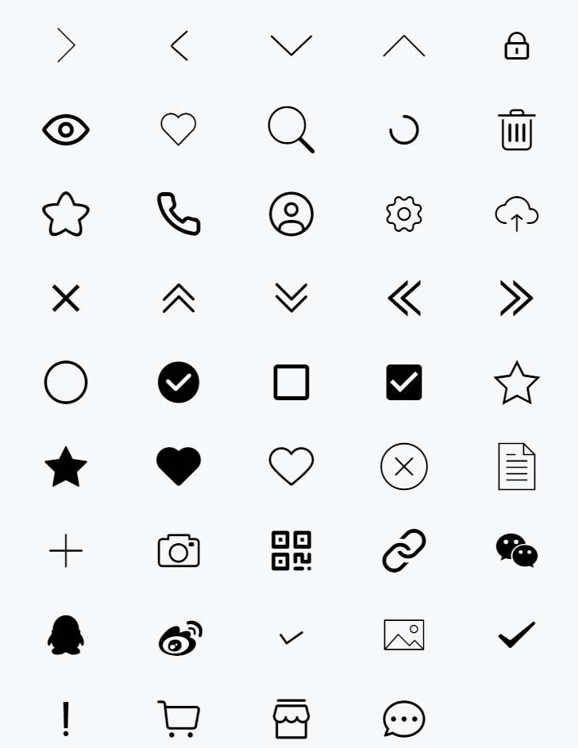
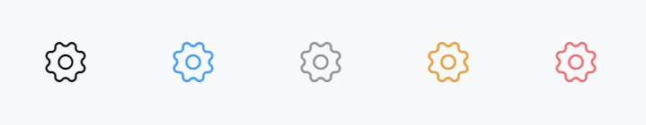
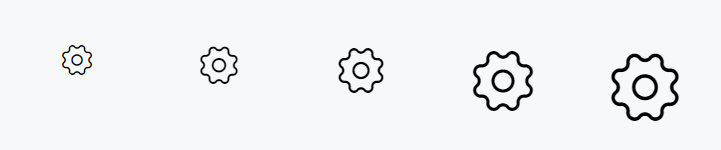
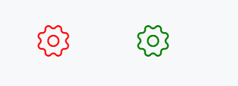

# Icon 图标

---

## 引入

在 app.json 或 index.json 中引入组件，详细介绍见[快速上手](/#/start)

```json
"usingComponents": {
  "lin-icon": "/dist/Icon/index"
}
```

## 基础图标

<div class='demo-block'>

</div>

:::demo

```html
<lin-icon size="30px" icon="{ {item}}" wx:for="{ {iconList}}" wx:key="item" />

Page({ 
      data: {
        iconList: [
        'arrow-right',
        'arrow-left',
        'arrow-down',
        'arrow-up',
        'password',
        'eye',
        'like',
        'search',
        'loading',
        'delete',
        'star',
        'phone',
        'user',
        'setting',
        'upload',
        "close",
        "uparrow",
        "downarrow",
        "leftarrow",
        "rightarrow",
        "round",
        "round-active",
        "square",
        "square-active",
        "star1-o",
        "star1",
        "like1",
        "like1-o",
        "error",
        "file",
        "add",
        "camera",
        "qrcode",
        "link",
        "wechat",
        "qq",
        "weibo",
        "gou",
        "pic",
        "success",
        "fail",
        "cart-o",
        "shop-o",
        "chat-o",
        ]
  },
 })
```

:::

## 主题风格

支持`default`、`primary`、`info`、`warning`、`danger`五种类型，默认为`default`

<div class='demo-block'>

</div>

:::demo

```html
<lin-icon size="30px" icon="setting" type="default" />
<lin-icon size="30px" icon="setting" type="primary" />
<lin-icon size="30px" icon="setting" type="info" />
<lin-icon size="30px" icon="setting" type="warning" />
<lin-icon size="30px" icon="setting" type="danger" />
```

:::

## 不同尺寸

通过`size`属性设置不同尺寸

<div class='demo-block'>

</div>

:::demo

```html
<lin-icon icon="setting" size="20px" />
<lin-icon icon="setting" size="25px" />
<lin-icon icon="setting" size="30px" />
<lin-icon icon="setting" size="40px" />
<lin-icon icon="setting" size="45px" />
```

:::

## 不同颜色

通过`color`属性图标颜色

<div class='demo-block'>

</div>

:::demo

```html
<lin-icon size="30px" color="red" icon="setting" />
<lin-icon size="30px" color="green" icon="setting" />
```

:::

## 属性

| 参数  | 说明     | 类型          | 可选值 | 默认值  |
| ----- | -------- | ------------- | ------ | ------- |
| icon  | 图标名称 | String        | —      | —       |
| type  | 图标类型 | String        | —      | default |
| size  | 图标大小 | String,Number | —      | —       |
| color | 图标颜色 | String        | —      | —       |

## 外部样式类

| 插槽名称     | 说明         |
| ------------ | ------------ |
| custom-class | 根节点样式类 |
