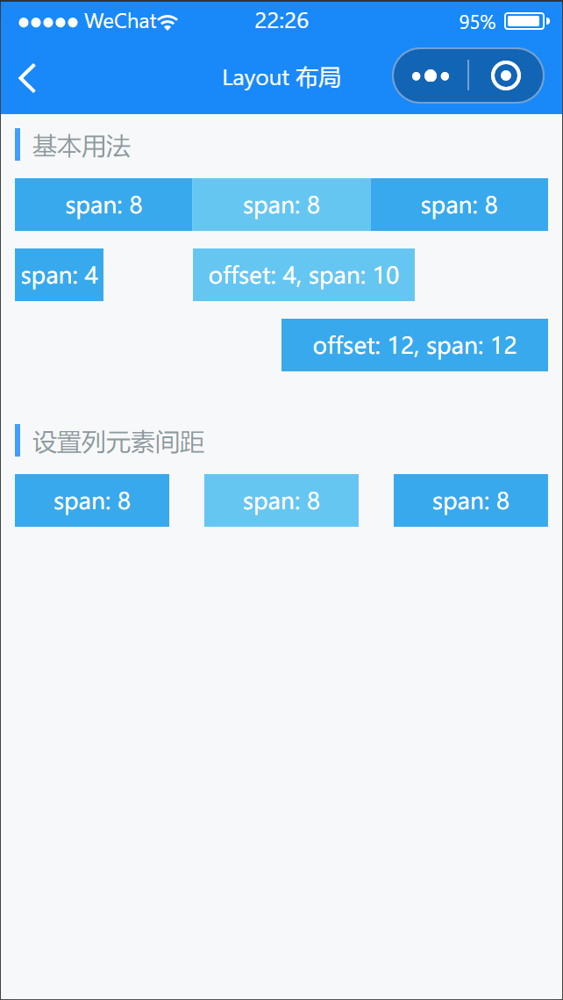

# Layout 布局

---

 <div class="demo-outer-container">
     <div class="demo-inner-container">
        <div class="demo-content">
            
        </div>
     </div>
 </div>

## 引入

在 app.json 或 index.json 中引入组件，详细介绍见[快速上手](/#/start)

```json
"usingComponents": {
  "lin-row": "/dist/Row/index",
  "lin-col": "/dist/Col/index"
}
```

## 基本用法

Layout 组件提供了`24列栅格`，通过在`Col`上添加`span`属性设置列所占的宽度百分比。此外，添加`offset`属性可以设置列的偏移宽度，计算方式与 span 相同

```html
<lin-row>
  <lin-col span="8">span: 8</lin-col>
  <lin-col span="8">span: 8</lin-col>
  <lin-col span="8">span: 8</lin-col>
</lin-row>
<lin-row>
  <lin-col span="4">span: 4</lin-col>
  <lin-col span="10" offset="4">offset: 4, span: 10</lin-col>
</lin-row>
<lin-row>
  <lin-col offset="12" span="12">offset: 12, span: 12</lin-col>
</lin-row>
```

## 设置列元素间距

通过`gutter`属性可以设置列元素之间的间距，默认间距为 0

```html
<lin-row gutter="20">
  <lin-col span="8">span: 8</lin-col>
  <lin-col span="8">span: 8</lin-col>
  <lin-col span="8">span: 8</lin-col>
</lin-row>
```

:::

## Row 属性

| 参数   | 说明                          | 类型   | 可选值 | 默认值 |
| ------ | ----------------------------- | ------ | ------ | ------ |
| gutter | 列元素之间的间距（单位为 px） | Number | —      | —      |

## Row 外部样式类

| 插槽名称     | 说明         |
| ------------ | ------------ |
| custom-class | 根节点样式类 |

## Col 属性

| 参数   | 说明           | 类型   | 可选值 | 默认值 |
| ------ | -------------- | ------ | ------ | ------ |
| span   | 列元素宽度     | Number | —      | —      |
| offset | 列元素偏移距离 | Number | —      | —      |

## Col 外部样式类

| 插槽名称     | 说明         |
| ------------ | ------------ |
| custom-class | 根节点样式类 |
