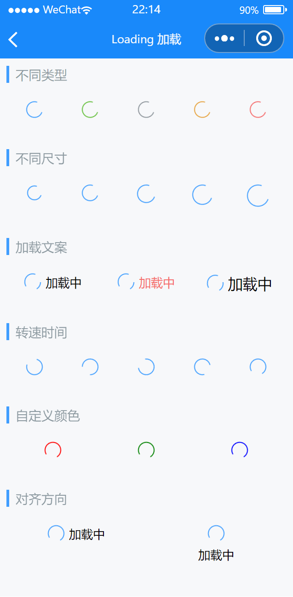

# Loading 加载

---


 <div class="demo-outer-container">
     <div class="demo-inner-container">
        <div class="demo-content">
            
        </div>
     </div>
 </div>

## 引入

在 app.json 或 index.json 中引入组件，详细介绍见[快速上手](/#/start)

```json
"usingComponents": {
  "lin-loading": "/dist/Loading/index"
}
```

## 加载类型

支持`success`、`primary`、`info`、`warning`、`danger`五种类型，默认为`primary`

```html
<lin-loading type="primary" />
<lin-loading type="success" />
<lin-loading type="info" />
<lin-loading type="warning" />
<lin-loading type="danger" />
```


## 加载尺寸

通过`size`属性设置加载的尺寸

```html
<lin-loading type="primary" size="14px" />
<lin-loading type="primary" size="16px" />
<lin-loading type="primary" size="18px" />
<lin-loading type="primary" size="20px" />
<lin-loading type="primary" size="22px" />
```


## 加载文案

通过`text`、`textColor`、`textSize`等属性设置加载文案样式

```html
<lin-loading type="primary" text="加载中" />
<lin-loading type="primary" text="加载中" textColor="#f56c6c" />
<lin-loading type="primary" text="加载中" textSize="16px" />
```


## 转速时间

通过`time`属性设置转速时间

```html
<lin-loading type="primary" time="300ms" />
<lin-loading type="primary" time="400ms" />
<lin-loading type="primary" time="500ms" />
<lin-loading type="primary" time="600ms" />
<lin-loading type="primary" time="700ms" />
```


## 自定义颜色

通过`color`属性设置颜色


```html
<lin-loading type="primary" color="red" />
<lin-loading type="primary" color="green" />
<lin-loading type="primary" color="blue" />
```


## 文案对齐方向

通过`vertical`属性文案对齐方向,支持`row`,`col`水平和垂直两种方向

```html
<lin-loading type="primary" text="加载中" vertical="row" />
<lin-loading type="primary" text="加载中" vertical="col" />
```


## 属性

| 参数  | 说明     | 类型          | 可选值 | 默认值  |
| ----- | -------- | ------------- | ------ | ------- |
| text  | 加载文案文案 | String        | —      | —       |
| type  | 图标类型 | String        | `primary`, `success`, `info`, `warning`, `danger`      | primary |
| size  | 尺寸大小 | String, Number | —      | —       |
| textColor | 加载文案颜色 | String        | —      | —       |
| textSize | 加载文案大小 | String, Number        | —      | —       |
| time | 转速时间 | String        | —      | —       |
| vertical | 加载文案对齐方式 | String        | `row`, `col`      | row       |
| color | 加载颜色 | String        | —      | —       |


## 外部样式类

| 插槽名称     | 说明         |
| ------------ | ------------ |
| custom-class | 根节点样式类 |
| text-class | 加载文案样式类 |
| loading-class | 加载样式类 |
