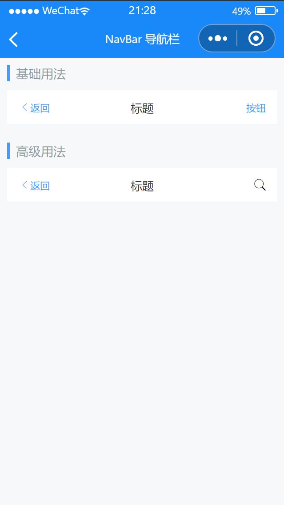

# NavBar 导航栏

---

 <div class="demo-outer-container">
     <div class="demo-inner-container">
        <div class="demo-content">
            
        </div>
     </div>
 </div>

## 引入

在 app.json 或 index.json 中引入组件，详细介绍见[快速上手](/#/start)

```json
"usingComponents": {
   "lin-nav-bar": "/dist/NavBar/index"
}
```

## 基础用法

:::demo

```html
<lin-nav-bar
  title="标题"
  left-text="返回"
  right-text="按钮"
  left-arrow
  bind:click-left="onClickLeft"
  bind:click-right="onClickRight"
/>
```

```javascript
Page({
  onClickLeft() {
    wx.showToast({ title: "点击返回", icon: "none" });
  },

  onClickRight() {
    wx.showToast({ title: "点击按钮", icon: "none" });
  },
});
```

:::

## 高级用法

通过 `slot` 定制内容

:::demo

```html
<lin-nav-bar title="标题" left-text="返回" left-arrow>
  <lin-icon icon="search" slot="right" />
</lin-nav-bar>
```

:::

## 属性

| 参数        | 说明             | 类型    | 可选值 | 默认值 |
| ----------- | ---------------- | ------- | ------ | ------ |
| title       | 标题             | String  | —      | —      |
| leftText    | 左侧文案         | String  | —      | —      |
| rightText   | 右侧文案         | String  | —      | —      |
| leftArrow   | 是否显示左侧箭头 | Boolean | —      | false  |
| fixed       | 是否固定在顶部   | Boolean | —      | false  |
| border      | 是否显示下边框   | Boolean | —      | true   |
| zIndex      | z-index 层级     | Number  | —      | 1      |
| customStyle | 根节点自定义样式 | String  | —      | —      |
| safeAreaInsetTop | 是否留出顶部安全距离（状态栏高度） | Boolean  | —      | false      |

## 事件

| 事件名           | 说明               | 参数 |
| ---------------- | ------------------ | ---- |
| bind:click-left  | 点击左侧按钮时触发 | —    |
| bind:click-right | 点击右侧按钮时触发 | —    |

## 外部样式类

| 类名     | 说明             |
| ------------ | ---------------- |
| custom-class | 根节点样式类     |
| left-class   | 左侧容器样式类   |
| right-class  | 右侧容器样式类   |
| title-class  | 标题样式类样式类 |
