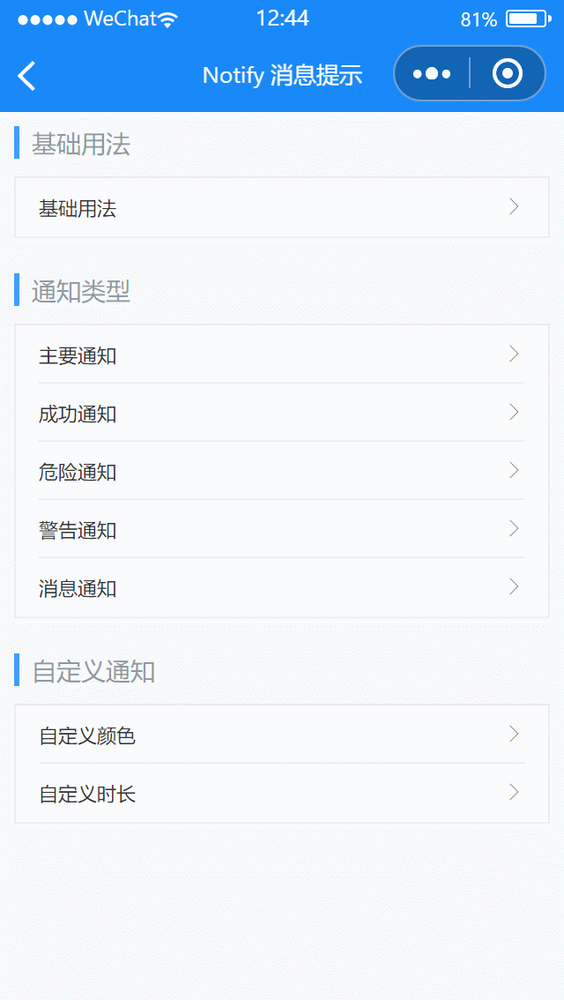

# Notify 消息提示

---

 <div class="demo-outer-container">
     <div class="demo-inner-container">
        <div class="demo-content">
            
        </div>
     </div>
 </div>

## 引入

在 app.json 或 index.json 中引入组件，详细介绍见[快速上手](/#/start)

```json
"usingComponents": {
  "lin-notify": "/dist/Notify/index"
}
```

## 基础用法

:::demo

```html
<lin-cell-group>
  <lin-cell
    title="基础用法"
    border="{ { false }}"
    is-link
    bind:click="onClick1"
  />
</lin-cell-group>

<lin-notify id="lin-notify" />
```

```javascript
import Notify from "/dist/Notify/notify";
Page({
  onClick1() {
    Notify("通知内容");
  },
});
```

:::

## 通知类型

支持`primary`、`success`、`warning`、`danger`、`info`五种通知类型，默认为`danger`

:::demo

```html
<lin-cell-group>
  <lin-cell
    data-type="primary"
    title="主要通知"
    is-link
    bind:click="onClick2"
  />
  <lin-cell
    data-type="success"
    title="成功通知"
    is-link
    bind:click="onClick2"
  />
  <lin-cell data-type="danger" title="危险通知" is-link bind:click="onClick2" />
  <lin-cell
    data-type="warning"
    title="警告通知"
    is-link
    bind:click="onClick2"
  />
  <lin-cell
    data-type="info"
    title="消息通知"
    is-link
    bind:click="onClick2"
    border="{ { false }}"
  />
</lin-cell-group>

<lin-notify id="lin-notify" />
```

```javascript
import Notify from "/dist/Notify/notify";
Page({
  onClick2(event) {
    const type = event.currentTarget.dataset.type;
    Notify({ type, message: "通知内容" });
  },
});
```

:::

## 自定义通知

自定义消息通知的颜色和展示时长

:::demo

```html
<lin-cell-group>
  <lin-cell title="自定义颜色" is-link bind:click="onClick3" />
  <lin-cell
    title="自定义时长"
    is-link
    bind:click="onClick4"
    border="{ { false }}"
  />
</lin-cell-group>

<lin-notify id="lin-notify" />
```

```javascript
import Notify from "/dist/Notify/notify";
Page({
  onClick3() {
    Notify({
      message: "自定义颜色",
      color: "#ad0000",
      background: "#ffe1e1",
    });
  },
  onClick4() {
    Notify({
      message: "自定义时长",
      duration: 1000,
    });
  },
});
```

:::

## 方法

| 方法名                     | 参数                   | 返回值      | 介绍                             |
| -------------------------- | ---------------------- | ----------- | -------------------------------- |
| Notify                     | options &#124; message | notify 实例 | 展示提示                         |
| Notify.clear               | options                | void        | 关闭提示                         |
| Notify.setDefaultOptions   | options                | void        | 修改默认配置，对所有 Notify 生效 |
| Notify.resetDefaultOptions | —                      | void        | 重置默认配置，对所有 Notify 生效 |

## Options

| 参数       | 说明                                     | 类型           | 可选值                                            | 默认值      |
| ---------- | ---------------------------------------- | -------------- | ------------------------------------------------- | ----------- |
| selector   | 自定义节点选择器                         | String         | —                                                 | #lin-notify |
| type       | 类型                                     | String         | `success`, `primary`, `warning`, `danger`, `info` | danger      |
| message    | 展示文案                                 | String         | —                                                 | —           |
| background | 背景颜色                                 | String         | —                                                 | —           |
| duration   | 展示时长(ms)，值为 0 时，notify 不会消失 | Number         | —                                                 | 3000        |
| zIndex     | z-index 层级                             | Number         | —                                                 | 100         |
| top        | 顶部距离                                 | String, Number | —                                                 | 0px         |
| color      | 字体颜色                                 | String         | —                                                 | #fff        |
| onClick    | 点击时的回调函数                         | Function       | —                                                 | —           |
| onOpened   | 完全展示后的回调函数                     | Function       | —                                                 | —           |
| oClose     | 关闭时的回调函数                         | Function       | —                                                 | —           |
| context     | 选择器的选择范围，可以传入自定义组件的 this 作为上下文 | Object   | —                                 | 当前页面   |
| safeAreaInsetTop | 是否留出顶部安全距离（状态栏高度） | Boolean  | —      | false      |

## 外部样式类

| 类名     | 说明         |
| ------------ | ------------ |
| custom-class | 根节点样式类 |
