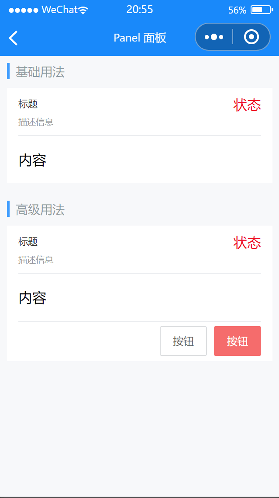

# Panel 面板

---

 <div class="demo-outer-container">
     <div class="demo-inner-container">
        <div class="demo-content">
            
        </div>
     </div>
 </div>

## 引入

在 app.json 或 index.json 中引入组件，详细介绍见[快速上手](/#/start)

```json
"usingComponents": {
  "lin-panel": "/dist/Panel/index"
}
```

## 基础用法

面板只是一个容器，里面可以放入自定义的内容

:::demo

```html
<lin-panel title="标题" desc="描述信息" status="状态">
  <view>内容</view>
</lin-panel>
```

:::

## 高级用法

使用`slot`自定义内容

:::demo

```html
<lin-panel title="标题" desc="描述信息" status="状态" use-footer-slot>
  <view>内容</view>
  <view slot="footer" class="panel-footer">
    <lin-button>按钮</lin-button>
    <lin-button class="panel-button" type="danger">按钮</lin-button>
  </view>
</lin-panel>
```

:::

## 属性

| 参数          | 说明                 | 类型    | 可选值 | 默认值 |
| ------------- | -------------------- | ------- | ------ | ------ |
| title         | 标题                 | String  | —      | —      |
| desc          | 描述                 | String  | —      | —      |
| status        | 状态                 | String  | —      | —      |
| useFooterSlot | 是否使用 footer slot | Boolean | —      | false  |

## 插槽

| 插槽名称 | 说明                                                           |
| -------- | -------------------------------------------------------------- |
| —        | 自定义内容                                                     |
| header   | 自定义 header，如果设置了`title`、`desc`、`status`属性则不生效 |
| footer   | 自定义 footer，需要设置 `use-footer-slot`属性                  |

## 外部样式类

| 插槽名称      | 说明         |
| ------------- | ------------ |
| custom-class  | 根节点样式类 |
| header-class  | 头部样式类   |
| content-class | 内容样式类   |
| footer-class  | 底部样式类   |
