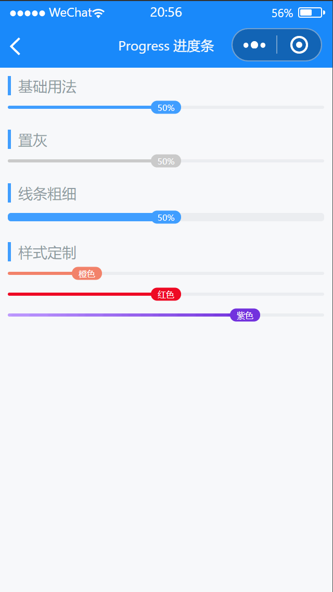

# Progress 进度条

---

 <div class="demo-outer-container">
     <div class="demo-inner-container">
        <div class="demo-content">
            
        </div>
     </div>
 </div>

## 引入

在 app.json 或 index.json 中引入组件，详细介绍见[快速上手](/#/start)

```json
"usingComponents": {
  "lin-progress": "/dist/Progress/index"
}
```

## 基础用法

进度条默认为蓝色，使用`percentage`属性来设置当前进度

:::demo

```html
<lin-progress percentage="50" />
```

:::

## 置灰

设置`inactive`属性后进度条将置灰。

:::demo

```html
<lin-progress inactive percentage="50" />
```

:::

## 线条粗细

通过`stroke-width`可以设置进度条的粗细

:::demo

```html
<lin-progress percentage="50" stroke-width="8px" />
```

:::

## 样式定制

可以使用`pivot-text`属性自定义文字，`color`属性自定义进度条颜色

:::demo

```html
<lin-progress pivot-text="橙色" color="#f2826a" percentage="25" />
<view class="lin-progress-item"></view>
<lin-progress pivot-text="红色" color="#ee0a24" percentage="50" />
<view class="lin-progress-item"></view>
<lin-progress
  percentage="75"
  pivot-text="紫色"
  pivot-color="#7232dd"
  color="linear-gradient(to right, #be99ff, #7232dd)"
/>
```

```css
.lin-progress-item {
  height: 40rpx;
}
```

:::

## 属性

| 参数        | 说明                      | 类型           | 可选值 | 默认值 |
| ----------- | ------------------------- | -------------- | ------ | ------ |
| inactive    | 是否置灰                  | Boolean        | —      | false  |
| percentage  | 进度百分比                | Number         | —      | 0      |
| strokeWidth | 进度条粗细，默认单位为 px | String, Number | —      | 0      |
| showPivot   | 是否显示进度文字          | Boolean        | —      | true   |
| color       | 进度条颜色                | String         | —      | —      |
| textColor   | 进度文字颜色              | String         | —      | —      |
| trackColor  | 轨道颜色                  | String         | —      | —      |
| pivotText   | 文字显示                  | String         | —      | —      |
| pivotColor  | 文字背景色                | String         | —      | —      |

## 外部样式类

| 插槽名称      | 说明         |
| ------------- | ------------ |
| custom-class  | 根节点样式类 |
| portion-class | 进度条样式类 |
| pivot-class   | 文字样式类   |
