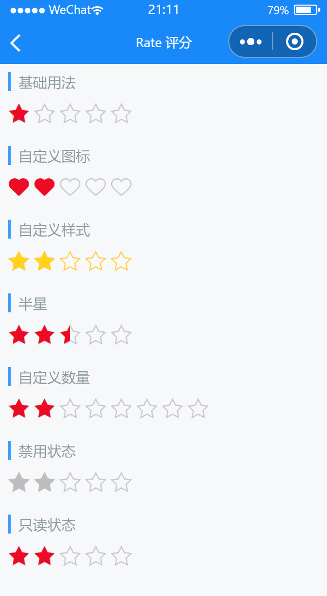

# Rate 评分

---

 <div class="demo-outer-container">
     <div class="demo-inner-container">
        <div class="demo-content">
            
        </div>
     </div>
 </div>

## 引入

在 app.json 或 index.json 中引入组件，详细介绍见[快速上手](/#/start)

```json
"usingComponents": {
  "lin-rate": "/dist/Rate/index"
}
```

## 基础用法

通过`value`绑定值

:::demo

```html
<lin-rate data-key="value1" value="{ { value1 }}" bind:change="onChange" />
```

```javascript
Page({
  data: {
    value1: 1,
  },
  onChange(event) {
    const key = event.currentTarget.dataset.key;
    this.setData({
      [key]: event.detail,
    });
  },
});
```

:::

## 自定义图标

通过`icon`和`voidIcon`属性设置选中状态和未选中状态的图标

:::demo

```html
<lin-rate
  icon="like1"
  voidIcon="like1-o"
  data-key="value2"
  value="{ { value2 }}"
  bind:change="onChange"
/>
```

```javascript
Page({
  data: {
    value2: 2,
  },
  onChange(event) {
    const key = event.currentTarget.dataset.key;
    this.setData({
      [key]: event.detail,
    });
  },
});
```

:::

## 自定义样式

通过`color`和`void-color`属性设置选中和未选中的颜色

:::demo

```html
<lin-rate
  data-key="value3"
  value="{ { value3 }}"
  size="25px"
  color="rgb(255, 210, 30)"
  void-color="rgb(255, 210, 30)"
  bind:change="onChange"
/>
```

```javascript
Page({
  data: {
    value3: 2,
  },
  onChange(event) {
    const key = event.currentTarget.dataset.key;
    this.setData({
      [key]: event.detail,
    });
  },
});
```

:::

## 半星

通过`allowHalf`属性设置半星

:::demo

```html
<lin-rate
  data-key="value4"
  value="{ { value4 }}"
  allowHalf
  bind:change="onChange"
/>
```

```javascript
Page({
  data: {
    value4: 2.5,
  },
  onChange(event) {
    const key = event.currentTarget.dataset.key;
    this.setData({
      [key]: event.detail,
    });
  },
});
```

:::

## 自定义数量

通过`count`属性设置评分数量

:::demo

```html
<lin-rate
  data-key="value5"
  value="{ { value5 }}"
  count="{ { 8 }}"
  bind:change="onChange"
/>
```

```javascript
Page({
  data: {
    value5: 2,
  },
  onChange(event) {
    const key = event.currentTarget.dataset.key;
    this.setData({
      [key]: event.detail,
    });
  },
});
```

:::

## 禁用状态

通过`disabled`属性设置为禁用状态

:::demo

```html
<lin-rate
  data-key="value6"
  value="{ { value6 }}"
  disabled
  bind:change="onChange"
/>
```

```javascript
Page({
  data: {
    value6: 2,
  },
  onChange(event) {
    const key = event.currentTarget.dataset.key;
    this.setData({
      [key]: event.detail,
    });
  },
});
```

:::

## 只读状态

通过`readonly`属性设置为只读状态

:::demo

```html
<lin-rate
  data-key="value7"
  value="{ { value7 }}"
  readonly
  bind:change="onChange"
/>
```

```javascript
Page({
  data: {
    value7: 2,
  },
  onChange(event) {
    const key = event.currentTarget.dataset.key;
    this.setData({
      [key]: event.detail,
    });
  },
});
```

:::

## 属性

| 参数          | 说明                    | 类型           | 可选值 | 默认值  |
| ------------- | ----------------------- | -------------- | ------ | ------- |
| gutter        | 图标间距，默认单位为 px | String,Number  | —      | 4px     |
| color         | 选中时的颜色            | String         | —      | #ee0a24 |
| voidColor     | 未选中时的颜色          | String         | —      | #c8c9cc |
| allowHalf     | 是否允许半选            | Boolean        | —      | false   |
| iconSize      | 图标大小，默认单位为 px | String, Number | —      | 50rpx   |
| value         | 当前分值                | Number         | —      | —       |
| count         | 图标总数                | Number         | —      | 5       |
| icon          | 选中时的图标名称        | String         | —      | star1   |
| voidIcon      | 未选中时的图标名称      | String         | —      | star1-o |
| readonly      | 是否为只读状态          | Boolean        | —      | false   |
| disabled      | 是否禁用评分            | Boolean        | —      | false   |
| disabledColor | 禁用时的颜色            | String         | —      | #bdbdbd |

## 事件

| 事件名      | 说明                     | 参数  |
| ----------- | ------------------------ | ----- |
| bind:change | 当前分值变化时触发的事件 | event |

## 外部样式类

| 插槽名称        | 说明               |
| --------------- | ------------------ |
| custom-class    | 根节点样式类       |
| icon-class      | 选中时图标样式类   |
| void-icon-class | 未选中时图标样式类 |
