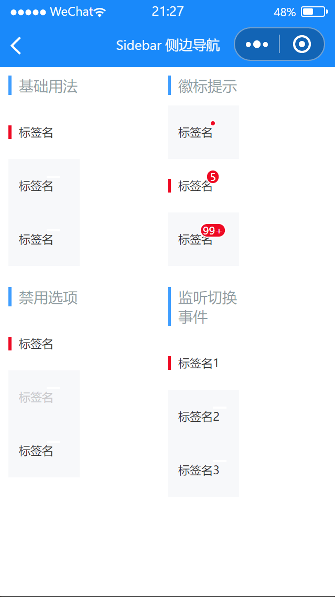

# Sidebar 侧边导航

---

 <div class="demo-outer-container">
     <div class="demo-inner-container">
        <div class="demo-content">
            
        </div>
     </div>
 </div>

## 引入

在 app.json 或 index.json 中引入组件，详细介绍见[快速上手](/#/start)

```json
"usingComponents": {
   "lin-sidebar": "/dist/Sidebar/index",
   "lin-sidebar-item": "/dist/SidebarItem/index"
}
```

## 基础用法

通过在`lin-sidebar`上设置`activeKey`属性来控制选中项

:::demo

```html
<lin-sidebar
  data-key="activeKey1"
  bind:change="onChange"
  active-key="{ { activeKey1 }}"
>
  <lin-sidebar-item title="标签名" />
  <lin-sidebar-item title="标签名" />
  <lin-sidebar-item title="标签名" />
</lin-sidebar>
```

```javascript
Page({
  data: {
    activeKey1: 0,
  },
  onChange(event) {
    const { key } = event.currentTarget.dataset;
    this.setData({
      [key]: event.detail,
    });
  },
});
```

:::

## 徽标提示

设置`dot`属性后，会在右上角展示一个小红点。设置`badge`属性后，会在右上角展示相应的徽标

:::demo

```html
<lin-sidebar
  data-key="activeKey2"
  active-key="{ { activeKey2 }}"
  bind:change="onChange"
>
  <lin-sidebar-item title="标签名" dot />
  <lin-sidebar-item title="标签名" badge="5" />
  <lin-sidebar-item title="标签名" badge="99+" />
</lin-sidebar>
```

```javascript
Page({
  data: {
    activeKey2: 1,
  },
  onChange(event) {
    const { key } = event.currentTarget.dataset;
    this.setData({
      [key]: event.detail,
    });
  },
});
```

:::

## 禁用选项

通过`disabled`属性禁用选项

:::demo

```html
<lin-sidebar
  data-key="activeKey3"
  active-key="{ { activeKey3 }}"
  bind:change="onChange"
>
  <lin-sidebar-item title="标签名" />
  <lin-sidebar-item title="标签名" disabled />
  <lin-sidebar-item title="标签名" />
</lin-sidebar>
```

```javascript
Page({
  data: {
    activeKey3: 0,
  },
  onChange(event) {
    const { key } = event.currentTarget.dataset;
    this.setData({
      [key]: event.detail,
    });
  },
});
```

:::

## 监听切换事件

设置`change`方法来监听切换导航项时的事件

:::demo

```html
<lin-sidebar
  data-key="activeKey4"
  active-key="{ { activeKey4 }}"
  bind:change="onChange1"
>
  <lin-sidebar-item title="标签名1" />
  <lin-sidebar-item title="标签名2" />
  <lin-sidebar-item title="标签名3" />
</lin-sidebar>
```

```javascript
Page({
  data: {
    activeKey4: 0,
  },
  onChange1(event) {
    const { key } = event.currentTarget.dataset;
    this.setData({
      [key]: event.detail,
    });
    wx.showToast({
      title: `标签${event.detail * 1 + 1}`,
      icon: "none",
    });
  },
});
```

:::

## Sidebar 属性

| 参数      | 说明         | 类型           | 可选值 | 默认值 |
| --------- | ------------ | -------------- | ------ | ------ |
| activeKey | 选中项的索引 | String, Number | —      | 0      |

## Sidebar 事件

| 事件名      | 说明           | 参数           |
| ----------- | -------------- | -------------- |
| bind:change | 切换选项时触发 | 当前选中的索引 |

## Sidebar 外部样式类

| 插槽名称     | 说明         |
| ------------ | ------------ |
| custom-class | 根节点样式类 |

## SidebarItem 属性

| 参数     | 说明                 | 类型           | 可选值 | 默认值 |
| -------- | -------------------- | -------------- | ------ | ------ |
| title    | 内容                 | String         | —      | —      |
| dot      | 是否显示右上角小红点 | Boolean        | —      | false  |
| badge    | 图标右上角徽标的内容 | String, Number | —      | —      |
| disabled | 是否禁用该项         | Boolean        | —      | false  |

## SidebarItem 外部样式类

| 插槽名称      | 说明         |
| ------------- | ------------ |
| custom-class  | 根节点样式类 |
| content-class | 内容样式类   |
