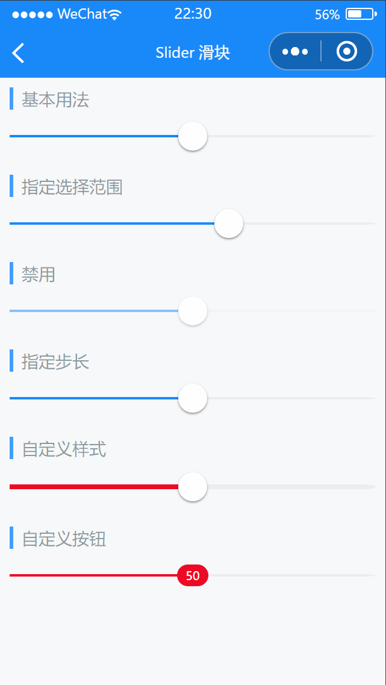

# Slider 滑块

---

 <div class="demo-outer-container">
     <div class="demo-inner-container">
        <div class="demo-content">
            
        </div>
     </div>
 </div>

## 引入

在 app.json 或 index.json 中引入组件，详细介绍见[快速上手](/#/start)

```json
"usingComponents": {
  "lin-slider": "/dist/Slider/index"
}
```

## 基本用法

通过`value`属性绑定值

:::demo

```html
<lin-slider data-key="value1" value="{ {value1}}" bind:change="onChange" />
```

```javascript
Page({
  data: {
    value1: 50,
  },
  onChange(event) {
    const key = event.currentTarget.dataset.key;
    this.setData({
      [key]: event.detail,
    });
    wx.showToast({
      icon: "none",
      title: `当前值是${event.detail}`,
    });
  },
});
```

:::

## 指定选择范围

通过`min`和`max`属性指定范围

:::demo

```html
<lin-slider
  min="-50"
  max="50"
  data-key="value2"
  value="{ {value2}}"
  bind:change="onChange"
/>
```

```javascript
Page({
  data: {
    value2: 10,
  },
  onChange(event) {
    const key = event.currentTarget.dataset.key;
    this.setData({
      [key]: event.detail,
    });
    wx.showToast({
      icon: "none",
      title: `当前值是${event.detail}`,
    });
  },
});
```

:::

## 禁用

通过`disabled`属性设置为禁用状态

:::demo

```html
<lin-slider
  disabled
  data-key="value3"
  value="{ {value3}}"
  bind:change="onChange"
/>
```

```javascript
Page({
  data: {
    value3: 50,
  },
  onChange(event) {
    const key = event.currentTarget.dataset.key;
    this.setData({
      [key]: event.detail,
    });
    wx.showToast({
      icon: "none",
      title: `当前值是${event.detail}`,
    });
  },
});
```

:::

## 指定步长

通过`step`属性设置指定步长

:::demo

```html
<lin-slider
  step="10"
  data-key="value4"
  value="{ {value4}}"
  bind:change="onChange"
/>
```

```javascript
Page({
  data: {
    value4: 50,
  },
  onChange(event) {
    const key = event.currentTarget.dataset.key;
    this.setData({
      [key]: event.detail,
    });
    wx.showToast({
      icon: "none",
      title: `当前值是${event.detail}`,
    });
  },
});
```

:::

## 自定义样式

通过`bar-height`，`active-colo`等属性可自定义样式

:::demo

```html
<lin-slider
  bar-height="4px"
  active-color="#ee0a24"
  data-key="value5"
  value="{ {value5}}"
  bind:change="onChange"
/>
```

```javascript
Page({
  data: {
    value5: 50,
  },
  onChange(event) {
    const key = event.currentTarget.dataset.key;
    this.setData({
      [key]: event.detail,
    });
    wx.showToast({
      icon: "none",
      title: `当前值是${event.detail}`,
    });
  },
});
```

:::

## 自定义按钮

通过插槽 `button` 可自定义按钮

:::demo

```html
<lin-slider
  active-color="#ee0a24"
  use-button-slot
  data-key="value6"
  value="{ {value6}}"
  bind:drag="onDrag"
>
  <view class="slider-custom-button" slot="button">
    { { value6 }}
  </view>
</lin-slider>
```

```javascript
Page({
  data: {
    value6: 50,
  },
  onDrag(event) {
    const key = event.currentTarget.dataset.key;
    this.setData({
      [key]: event.detail,
    });
  },
});
```

:::

## 属性

| 参数          | 说明                             | 类型           | 可选值 | 默认值 |
| ------------- | -------------------------------- | -------------- | ------ | ------ |
| value         | 当前进度百分比，取值范围为 0-100 | Number         | 0-100  | 0      |
| disabled      | 是否禁用滑块                     | Boolean        | —      | false  |
| max           | 最大值                           | Number         | —      | 100    |
| min           | 最小值                           | Number         | —      | 0      |
| step          | 步长                             | Number         | —      | 1      |
| barHeight     | 进度条高度，默认单位为 px        | String, Number | —      | 2px    |
| activeColor   | 进度条激活态颜色                 | String         | —      | —      |
| inactiveColor | 进度条默认颜色                   | String         | —      | —      |
| useButtonSlot | 是否使用 button 插槽             | Boolean        | —      | false  |

## 事件

| 事件名          | 说明             | 参数     |
| --------------- | ---------------- | -------- |
| bind:drag-start | 开始拖动时触发   | —        |
| bind:drag-end   | 结束拖动时触发   | —        |
| bind:change     | 进度值改变后触发 | 当前进度 |
| bind:drag       | 拖动进度条时触发 | 当前进度 |

## 插槽

| 插槽名称 | 说明                                                      |
| -------- | --------------------------------------------------------- |
| button   | 自定义按钮插槽，需要在`useButtonSlot`为 `true` 时才会显示 |

## 外部样式类

| 类名     | 说明         |
| ------------ | ------------ |
| custom-class | 根节点样式类 |
| bar-class    | 进度条样式类 |
| button-class | 按钮样式类   |
