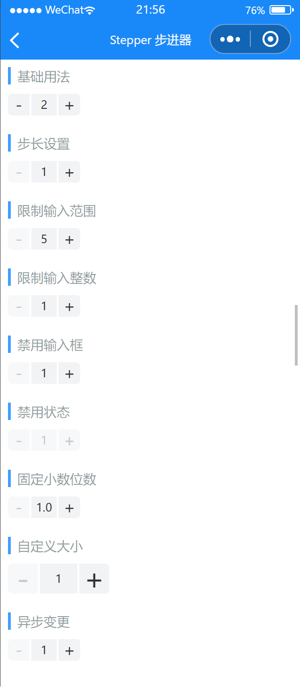

# Stepper 步进器

---

 <div class="demo-outer-container">
     <div class="demo-inner-container">
        <div class="demo-content">
            
        </div>
     </div>
 </div>

## 引入

在 app.json 或 index.json 中引入组件，详细介绍见[快速上手](/#/start)

```json
"usingComponents": {
  "lin-stepper": "/dist/Stepper/index"
}
```

## 基础用法

通过`value`设置输入值，可以通过`change`事件监听到输入值的变化

:::demo

```html
<lin-stepper value="{ { 2 }}" bind:change="onChange" />
```

```javascript
Page({
  onChange(event) {
    wx.showToast({
      icon: "none",
      title: `当前值：${event.detail}`,
    });
  },
});
```

:::

## 步长设置

通过`step`属性设置每次点击增加或减少按钮时变化的值，默认为`1`

:::demo

```html
<lin-stepper value="{ { 1 }}" step="2" bind:change="onChange" />
```

```javascript
Page({
  onChange(event) {
    wx.showToast({
      icon: "none",
      title: `当前值：${event.detail}`,
    });
  },
});
```

:::

## 限制输入范围

通过`min`和`max`属性限制输入值的范围

:::demo

```html
<lin-stepper value="{ { 5 }}" min="5" max="8" bind:change="onChange" />
```

```javascript
Page({
  onChange(event) {
    wx.showToast({
      icon: "none",
      title: `当前值：${event.detail}`,
    });
  },
});
```

:::

## 限制输入整数

设置`integer`属性后，输入框将限制只能输入整数

:::demo

```html
<lin-stepper value="{ { 1 }}" integer bind:change="onChange" />
```

```javascript
Page({
  onChange(event) {
    wx.showToast({
      icon: "none",
      title: `当前值：${event.detail}`,
    });
  },
});
```

:::

## 禁用输入框

通过设置`disableInput`属性来禁用步进器的输入框

:::demo

```html
<lin-stepper value="{ { 1 }}" disableInput />
```

```javascript
Page({
  onChange(event) {
    wx.showToast({
      icon: "none",
      title: `当前值：${event.detail}`,
    });
  },
});
```

:::

## 禁用状态

通过设置`disabled`属性来禁用步进器，禁用状态下无法点击按钮或修改输入框

:::demo

```html
<lin-stepper value="{ { 1 }}" disabled />
```

```javascript
Page({
  onChange(event) {
    wx.showToast({
      icon: "none",
      title: `当前值：${event.detail}`,
    });
  },
});
```

:::

## 固定小数位数

通过设置`decimal-length`属性可以保留固定的小数位数

:::demo

```html
<lin-stepper
  value="{ { 1 }}"
  step="0.2"
  decimal-length="{ { 1 }}"
  bind:change="onChange"
/>
```

```javascript
Page({
  onChange(event) {
    wx.showToast({
      icon: "none",
      title: `当前值：${event.detail}`,
    });
  },
});
```

:::

## 自定义大小

通过`input-width`属性设置输入框宽度，通过`button-size`属性设置按钮大小和输入框高度

:::demo

```html
<lin-stepper
  value="{ { 1 }}"
  buttonFontSize="30px"
  input-width="40px"
  button-size="32px"
  bind:change="onChange"
/>
```

```javascript
Page({
  onChange(event) {
    wx.showToast({
      icon: "none",
      title: `当前值：${event.detail}`,
    });
  },
});
```

:::

## 异步变更

如果需要异步地修改输入框的值，可以设置`async-change`属性，并在`change`事件中手动修改`value`

:::demo

```html
<lin-stepper value="{ { value }}" async-change bind:change="onChange1" />
```

```javascript
Page({
  data: {
    value: 1,
  },
  onChange1(event) {
    setTimeout(() => {
      this.setData({
        value: event.detail,
      });
    }, 3000);
  },
});
```

:::

## 属性

| 参数           | 说明                                                    | 类型           | 可选值 | 默认值 |
| -------------- | ------------------------------------------------------- | -------------- | ------ | ------ |
| name           | 在表单内提交时的标识符                                  | String         | —      | —      |
| value          | 输入值                                                  | Number         | —      | —      |
| min            | 最小值                                                  | Number         | —      | 1      |
| max            | 最大值                                                  | Number         | —      | —      |
| step           | 步长                                                    | Number         | —      | 1      |
| integer        | 是否只允许输入整数                                      | Boolean        | —      | false  |
| disabled       | 是否禁用                                                | Boolean        | —      | false  |
| decimalLength  | 固定显示的小数位数                                      | Number         | —      | —      |
| inputWidth     | 输入框宽度，默认单位为 px                               | String, Number | —      | 64rpx  |
| buttonSize     | 按钮大小，默认单位为 px，输入框高度会和按钮大小保持一致 | String, Number | —      | 56rpx  |
| buttonFontSize | 按钮字体大小                                            | String, Number | —      | 40rpx  |
| inputFontSize  | 输入框字体大小                                          | String, Number | —      | 30rpx  |
| disableInput   | 是否禁用输入框                                          | Boolean        | —      | false  |
| showPlus       | 是否显示增加按钮                                        | Boolean        | —      | true   |
| showMinus      | 是否显示减少按钮                                        | Boolean        | —      | true   |
| disablePlus    | 是否禁用增加按钮                                        | Boolean        | —      | false  |
| disableMinus   | 是否禁用减少按钮                                        | Boolean        | —      | false  |
| asyncChange    | 是否开启异步变更，开启后需要手动控制输入值              | Boolean        | —      | false  |
| longPress      | 是否开启长按手势                                        | Boolean        | —      | true   |

## 事件

| 事件名         | 说明                     | 参数          |
| -------------- | ------------------------ | ------------- |
| bind:overlimit | 点击不可用的按钮时触发   | {type:'minus' | 'plus'} |
| bind:minus     | 点击减少按钮时触发       | —             |
| bind:plus      | 点击增加按钮时触发       | —             |
| bind:blur      | 输入框失焦时触发         | 输入框的值    |
| bind:focus     | 输入框聚焦时触发         | 输入框的值    |
| bind:change    | 当绑定值变化时触发的事件 | 输入框的值    |

## 外部样式类

| 插槽名称     | 说明           |
| ------------ | -------------- |
| custom-class | 根节点样式类   |
| input-class  | 输入框样式类   |
| plus-class   | 加号按钮样式类 |
| minus-class  | 减号按钮样式类 |
