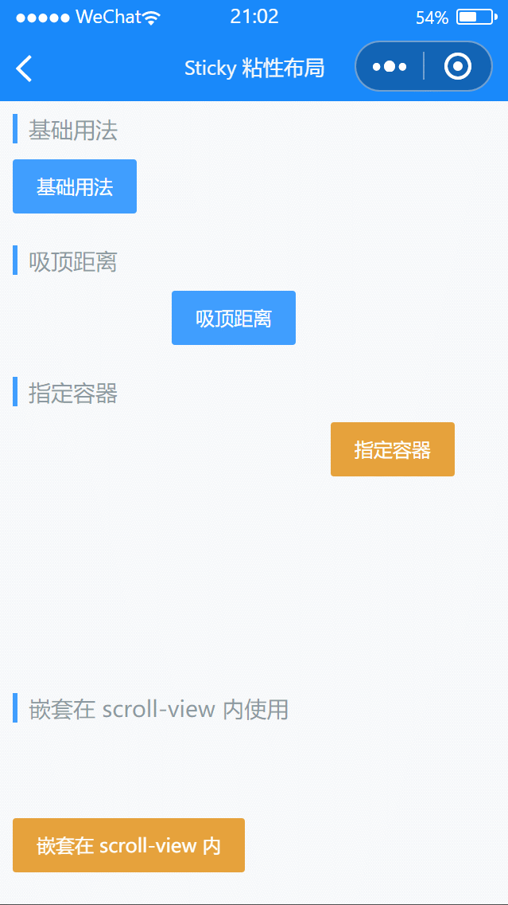

# Sticky 粘性布局

---

 <div class="demo-outer-container">
     <div class="demo-inner-container">
        <div class="demo-content">
            
        </div>
     </div>
 </div>

## 引入

在 app.json 或 index.json 中引入组件，详细介绍见[快速上手](/#/start)

```json
"usingComponents": {
  "lin-sticky": "/dist/Sticky/index"
}
```

## 基础用法

将内容包裹在`Sticky`组件内即可

:::demo

```html
<lin-sticky>
  <lin-button type="primary">基础用法</lin-button>
</lin-sticky>
```

:::

## 吸顶距离

通过`offset-top`属性可以设置组件在吸顶时与顶部的距离

:::demo

```html
<lin-sticky offset-top="{ { 50 }}">
  <lin-button style="margin-left:100px" type="primary">吸顶距离</lin-button>
</lin-sticky>
```

:::

## 指定容器

通过`container`属性可以指定组件的容器，页面滚动时，组件会始终保持在容器范围内，当组件即将超出容器底部时，会返回原位置

:::demo

```html
<view id="container" style="height: 150px;">
  <lin-sticky container="{ { container }}">
    <lin-button style="margin-left:200px" type="warning">
      指定容器
    </lin-button>
  </lin-sticky>
</view>
```

```javascript
Page({
  data: {
    container: null,
  },
  onReady: function() {
    this.setData({
      container: () => wx.createSelectorQuery().select("#container"),
    });
  },
});
```

:::

## 嵌套在 scroll-view 内使用

通过 `scroll-top` 与 `offset-top` 属性可以实现在 scroll-view 内嵌套使用

:::demo

```html
<scroll-view
  bind:scroll="onScroll"
  scroll-y
  id="scroller"
  style="height: 200px;"
>
  <view style="height: 400px; padding-top: 50px;">
    <lin-sticky scroll-top="{ { scrollTop }}" offset-top="{ { offsetTop }}">
      <lin-button type="warning">
        嵌套在 scroll-view 内
      </lin-button>
    </lin-sticky>
  </view>
</scroll-view>
```

```javascript
Page({
  data: {
    scrollTop: 0,
    offsetTop: 0,
  },
  onScroll(event) {
    wx.createSelectorQuery()
      .select("#scroller")
      .boundingClientRect((res) => {
        this.setData({
          scrollTop: event.detail.scrollTop,
          offsetTop: res.top,
        });
      })
      .exec();
  },
});
```

:::

## 属性

| 参数      | 说明                                                       | 类型     | 可选值 | 默认值 |
| --------- | ---------------------------------------------------------- | -------- | ------ | ------ |
| offsetTop | 吸顶时与顶部的距离，单位 px                                | Number   | —      | 0      |
| zIndex    | 吸顶时的 z-index                                           | Number   | —      | 99     |
| disabled  | 是否禁用                                                   | Boolean  | —      | false  |
| container | 一个函数，返回容器对应的 NodesRef 节点                     | Function | —      | —      |
| scrollTop | 当前滚动区域的滚动位置，非 null 时会禁用页面滚动事件的监听 | Function | —      | —      |

## 事件

| 事件名      | 说明       | 参数                                           |
| ----------- | ---------- | ---------------------------------------------- |
| bind:scroll | 滚动时触发 | { scrollTop: 距离顶部位置, isFixed: 是否吸顶 } |

## 外部样式类

| 类名      | 说明         |
| ------------- | ------------ |
| custom-class  | 根节点样式类 |
| wrapper-class | 容器样式类   |
