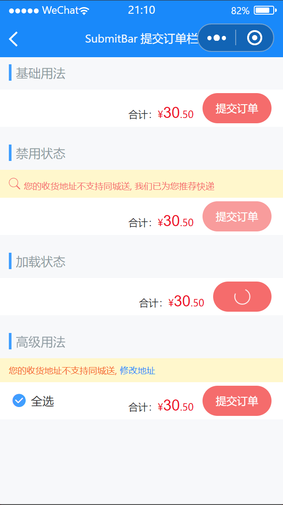

# SubmitBar 提交订单栏

---

 <div class="demo-outer-container">
     <div class="demo-inner-container">
        <div class="demo-content">
            
        </div>
     </div>
 </div>

## 引入

在 app.json 或 index.json 中引入组件，详细介绍见[快速上手](/#/start)

```json
"usingComponents": {
   "lin-submit-bar": "/dist/SubmitBar/index"
}
```

## 基础用法

:::demo

```html
<lin-submit-bar price="30.50" button-text="提交订单" bind:submit="onSubmit" />
```

```javascript
Page({
  onSubmit() {
    wx.showToast({
      title: "submit",
      icon: "none",
    });
  },
});
```

:::

## 禁用状态

禁用状态下不会触发`submit`事件

:::demo

```html
<lin-submit-bar
  disabled
  price="{ { 30.50 }}"
  button-text="提交订单"
  tip="您的收货地址不支持同城送, 我们已为您推荐快递"
  tip-icon="search"
  bind:submit="onSubmit"
/>
```

```javascript
Page({
  onSubmit() {
    wx.showToast({
      title: "submit",
      icon: "none",
    });
  },
});
```

:::

## 加载状态

加载状态下不会触发`submit`事件

:::demo

```html
<lin-submit-bar
  loading
  price="30.50"
  button-text="提交订单"
  bind:submit="onSubmit"
/>
```

```javascript
Page({
  onSubmit() {
    wx.showToast({
      title: "submit",
      icon: "none",
    });
  },
});
```

:::

## 高级用法

通过插槽插入自定义内容

:::demo

```html
<lin-submit-bar price="30.50" button-text="提交订单" bind:submit="onSubmit">
  <lin-checkbox bind:change="onChange" value="{ {checked}}">全选</lin-checkbox>
  <view class="tip-wrapper" slot="tip"
    >您的收货地址不支持同城送, <text class="tip-text">修改地址</text></view
  >
</lin-submit-bar>
```

```javascript
Page({
  data: {
    checked: true,
  },
  onChange(event) {
    this.setData({
      checked: event.detail,
    });
  },

  onSubmit() {
    wx.showToast({
      title: "submit",
      icon: "none",
    });
  },
});
```

```css
.tip-wrapper {
  padding: 16rpx 24rpx;
  color: #f56723;
  font-size: 24rpx;
  line-height: 1.5;
  background-color: #fff7cc;
}

.tip-text {
  color: #1989fa;
}
```

:::

## 属性

| 参数          | 说明                 | 类型           | 可选值                                                                  | 默认值 |
| ------------- | -------------------- | -------------- | ----------------------------------------------------------------------- | ------ |
| price         | 价格                 | String, Number | —                                                                       | —      |
| label         | 价格文案             | String         | —                                                                       | 合计： |
| suffixLabel   | 价格右侧文案         | String         | —                                                                       | —      |
| buttonText    | 按钮文字             | String         | —                                                                       | —      |
| buttonType    | 按钮类型             | String         | `primary`, `success`, `info`, `warning`, `danger`, `default`, `success` | danger |
| tip           | 提示文案             | String         | —                                                                       | —      |
| tipIcon       | 图标名称             | String         | —                                                                       | —      |
| disabled      | 是否禁用按钮         | Boolean        | —                                                                       | false  |
| loading       | 是否显示加载中的按钮 | Boolean        | —                                                                       | false  |
| currency      | 货币符号             | String         | —                                                                       | ¥      |
| decimalLength | 价格小数点后位数     | Number         | —                                                                       | 2      |

## 事件

| 事件名      | 说明             | 参数 |
| ----------- | ---------------- | ---- |
| bind:submit | 按钮点击事件回调 | —    |

## 插槽

| 插槽名称 | 说明                 |
| -------- | -------------------- |
| —        | 自定义订单栏左侧内容 |
| tip      | 自定义提示文案       |

## 外部样式类

| 类名          | 说明               |
| ----------------- | ------------------ |
| custom-class      | 根节点样式类       |
| tip-class         | 提示文案容器样式类 |
| tip-text-class    | 提示文案样式类     |
| content-class     | 内容容器样式类     |
| text-class        | 文本容器样式类     |
| label-class       | 文本样式类         |
| price-class       | 价格容器样式类     |
| currency-class    | 货币单位样式类     |
| integer-class     | 整数样式类         |
| decimal-class     | 小数样式类         |
| suffixLabel-class | 价格右侧文案样式类 |
| button-class      | 按钮样式类         |
