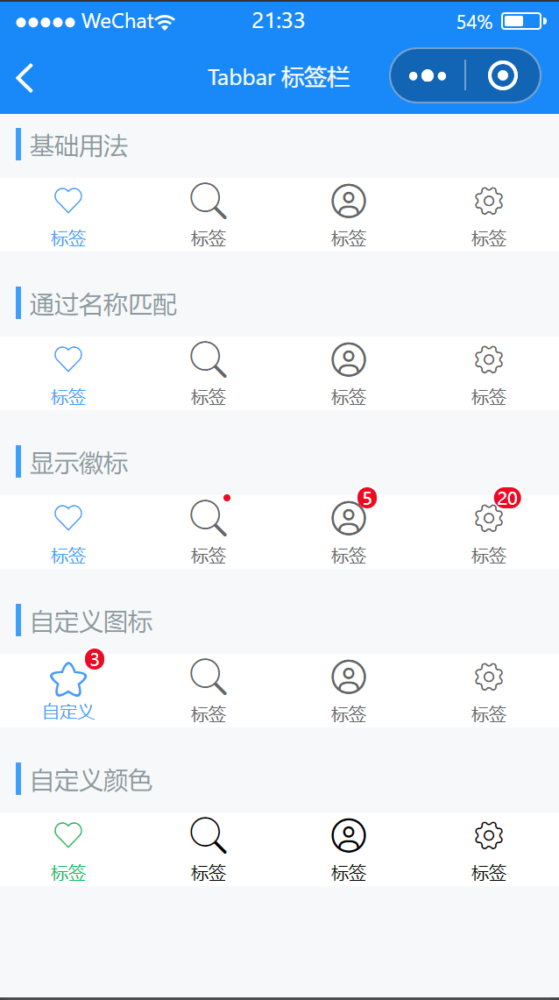

# Tabbar 标签栏

---

 <div class="demo-outer-container">
     <div class="demo-inner-container">
        <div class="demo-content">
            
        </div>
     </div>
 </div>

## 引入

在 app.json 或 index.json 中引入组件，详细介绍见[快速上手](/#/start)

```json
"usingComponents": {
   "lin-tabbar": "/dist/Tabbar/index",
   "lin-tabbar-item": "/dist/TabbarItem/index"
}
```

## 基础用法

通过`active`设定当前激活标签对应的索引值

:::demo

```html
<lin-tabbar
  safeAreaInsetBottom="{ {false}}"
  fixed="{ {false}}"
  border="{ {false}}"
  data-key="active1"
  active="{ { active1 }}"
  bind:change="onChange"
>
  <lin-tabbar-item icon="like">标签</lin-tabbar-item>
  <lin-tabbar-item icon="search">标签</lin-tabbar-item>
  <lin-tabbar-item icon="user">标签</lin-tabbar-item>
  <lin-tabbar-item icon="setting">标签</lin-tabbar-item>
</lin-tabbar>
```

```javascript
Page({
  data: {
    active1: 0,
  },
  onChange(event) {
    const { key } = event.currentTarget.dataset;
    this.setData({ [key]: event.detail });
  },
});
```

:::

## 通过名称匹配

在标签指定`name`属性的情况下，`active`的值为当前标签的`name`

:::demo

```html
<lin-tabbar
  safeAreaInsetBottom="{ {false}}"
  fixed="{ {false}}"
  border="{ {false}}"
  data-key="active2"
  active="{ { active2 }}"
  bind:change="onChange"
>
  <lin-tabbar-item name="like" icon="like">标签</lin-tabbar-item>
  <lin-tabbar-item name="search" icon="search">标签</lin-tabbar-item>
  <lin-tabbar-item name="user" icon="user">标签</lin-tabbar-item>
  <lin-tabbar-item name="setting" icon="setting">标签</lin-tabbar-item>
</lin-tabbar>
```

```javascript
Page({
  data: {
    active2: "like",
  },
  onChange(event) {
    const { key } = event.currentTarget.dataset;
    this.setData({ [key]: event.detail });
  },
});
```

:::

## 显示徽标

设置`dot`属性后，会在右上角展示一个小红点。设置`badge`属性后，会在右上角展示相应的徽标

:::demo

```html
<lin-tabbar
  safeAreaInsetBottom="{ {false}}"
  fixed="{ {false}}"
  border="{ {false}}"
  data-key="active3"
  active="{ { active3 }}"
  bind:change="onChange"
>
  <lin-tabbar-item icon="like">标签</lin-tabbar-item>
  <lin-tabbar-item icon="search" dot>标签</lin-tabbar-item>
  <lin-tabbar-item icon="user" info="5">标签</lin-tabbar-item>
  <lin-tabbar-item icon="setting" info="20">标签</lin-tabbar-item>
</lin-tabbar>
```

```javascript
Page({
  data: {
    active3: 0,
  },
  onChange(event) {
    const { key } = event.currentTarget.dataset;
    this.setData({ [key]: event.detail });
  },
});
```

:::

## 自定义图标

可以通过 slot 自定义图标，其中 `icon` slot 代表未选中状态下的图标，`icon-active` slot 代表选中状态下的图标

:::demo

```html
<lin-tabbar
  safeAreaInsetBottom="{ {false}}"
  fixed="{ {false}}"
  border="{ {false}}"
  data-key="active4"
  active="{ { active4 }}"
  bind:change="onChange"
>
  <lin-tabbar-item info="3">
    <lin-icon size="50rpx" icon="star" slot="icon" />
    <lin-icon size="50rpx" icon="star" slot="icon-active" />
    自定义
  </lin-tabbar-item>
  <lin-tabbar-item icon="search">标签</lin-tabbar-item>
  <lin-tabbar-item icon="user">标签</lin-tabbar-item>
  <lin-tabbar-item icon="setting">标签</lin-tabbar-item>
</lin-tabbar>
```

```javascript
Page({
  data: {
    active4: 0,
  },
  onChange(event) {
    const { key } = event.currentTarget.dataset;
    this.setData({ [key]: event.detail });
  },
});
```

:::

## 自定义颜色

通过`active-color`设置选中标签的颜色，`inactive-color`设置未选中标签的颜色

:::demo

```html
<lin-tabbar
  safeAreaInsetBottom="{ {false}}"
  active-color="#07c160"
  inactive-color="#000"
  fixed="{ {false}}"
  border="{ {false}}"
  data-key="active5"
  active="{ { active5 }}"
  bind:change="onChange"
>
  <lin-tabbar-item icon="like">标签</lin-tabbar-item>
  <lin-tabbar-item icon="search">标签</lin-tabbar-item>
  <lin-tabbar-item icon="user">标签</lin-tabbar-item>
  <lin-tabbar-item icon="setting">标签</lin-tabbar-item>
</lin-tabbar>
```

```javascript
Page({
  data: {
    active5: 0,
  },
  onChange(event) {
    const { key } = event.currentTarget.dataset;
    this.setData({ [key]: event.detail });
  },
});
```

:::

## Tabbar 属性

| 参数                | 说明                                               | 类型           | 可选值 | 默认值 |
| ------------------- | -------------------------------------------------- | -------------- | ------ | ------ |
| active              | 当前选中标签的索引                                 | String, Number | —      | 0      |
| fixed               | 是否固定在底部                                     | Boolean        | —      | false  |
| placeholder         | 固定在底部时，是否在标签位置生成一个等高的占位元素 | Boolean        | —      | false  |
| border              | 是否展示外边框                                     | Boolean        | —      | true   |
| zIndex              | 元素 z-index                                       | Number         | —      | —      |
| activeColor         | 选中标签的颜色                                     | String         | —      | —      |
| inactiveColor       | 未选中标签的颜色                                   | String         | —      | —      |
| safeAreaInsetBottom | 是否为 iPhoneX 留出底部安全距离                    | Boolean        | —      | true   |

## Tabbar 事件

| 事件名      | 说明           | 参数                       |
| ----------- | -------------- | -------------------------- |
| bind:change | 切换标签时触发 | 当前选中标签的名称或索引值 |

## Tabbar 外部样式类

| 类名              | 说明           |
| ----------------- | -------------- |
| custom-class      | 根节点样式类   |
| placeholder-class | 占位元素样式类 |

## TabbarItem 属性

| 参数 | 说明                       | 类型           | 可选值 | 默认值 |
| ---- | -------------------------- | -------------- | ------ | ------ |
| name | 标签名称，作为匹配的标识符 | String, Number | —      | —      |
| icon | 图标名称                   | String         | —      | —      |
| dot  | 是否显示小红点             | Boolean        | —      | false  |
| info | 图标右上角提示信息         | String, Number | —      | —      |

## TabbarItem 插槽

| 插槽名称    | 说明           |
| ----------- | -------------- |
| —           | 默认显示内容   |
| icon        | 未选中时的图标 |
| icon-active | 选中时的图标   |

## TabbarItem 外部样式类

| 类名          | 说明           |
| ------------- | -------------- |
| custom-class  | 根节点样式类   |
| content-class | 选项内容样式类 |
