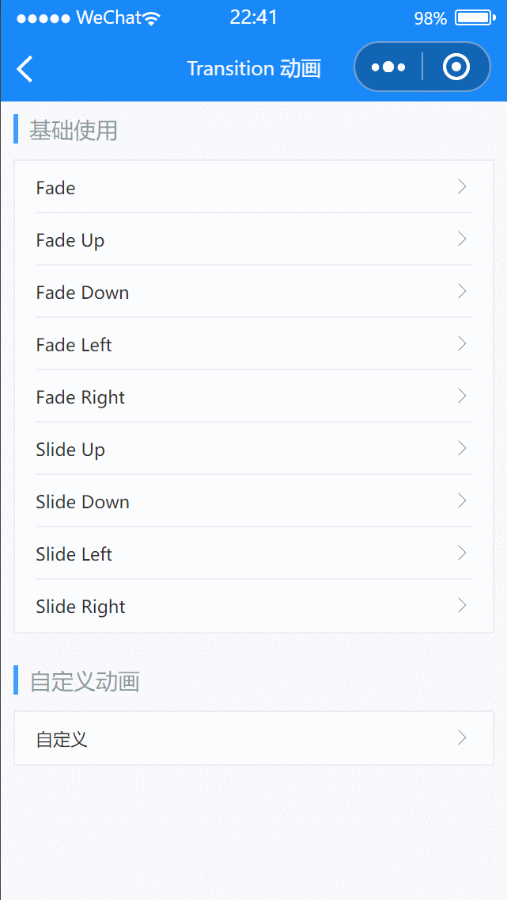

# Transition 动画

---

 <div class="demo-outer-container">
     <div class="demo-inner-container">
        <div class="demo-content">
            
        </div>
     </div>
 </div>

## 引入

在 app.json 或 index.json 中引入组件，详细介绍见[快速上手](/#/start)

```json
"usingComponents": {
  "lin-transition": "/dist/Transition/index"
}
```

## 基础使用

将元素包裹在 `transition` 组件内，在元素展示/隐藏时，会有相应的过渡动画

:::demo

```html
<lin-cell-group>
  <lin-cell data-show="show1" bind:click="setShowData" title="Fade" is-link />
  <lin-cell
    data-show="show2"
    bind:click="setShowData"
    title="Fade Up"
    is-link
  />
  <lin-cell
    data-show="show3"
    bind:click="setShowData"
    title="Fade Down"
    is-link
  />
  <lin-cell
    data-show="show4"
    bind:click="setShowData"
    title="Fade Left"
    is-link
  />
  <lin-cell
    data-show="show5"
    bind:click="setShowData"
    title="Fade Right"
    is-link
  />
  <lin-cell
    data-show="show6"
    bind:click="setShowData"
    title="Slide Up"
    is-link
  />
  <lin-cell
    data-show="show7"
    bind:click="setShowData"
    title="Slide Down"
    is-link
  />
  <lin-cell
    data-show="show8"
    bind:click="setShowData"
    title="Slide Left"
    is-link
  />
  <lin-cell
    data-show="show9"
    bind:click="setShowData"
    title="Slide Right"
    is-link
  />
</lin-cell-group>

<lin-transition
  data-show="show1"
  show="{ {show1}}"
  bind:after-enter="afterEnter"
>
  <view class="transition-content">
    fade
  </view>
</lin-transition>

<lin-transition
  name="fade-up"
  data-show="show2"
  show="{ {show2}}"
  bind:after-enter="afterEnter"
>
  <view class="transition-content">
    Fade Up
  </view>
</lin-transition>

<lin-transition
  name="fade-down"
  data-show="show3"
  show="{ {show3}}"
  bind:after-enter="afterEnter"
>
  <view class="transition-content">
    Fade Down
  </view>
</lin-transition>

<lin-transition
  name="fade-left"
  data-show="show4"
  show="{ {show4}}"
  bind:after-enter="afterEnter"
>
  <view class="transition-content">
    Fade Left
  </view>
</lin-transition>

<lin-transition
  name="fade-right"
  data-show="show5"
  show="{ {show5}}"
  bind:after-enter="afterEnter"
>
  <view class="transition-content">
    Fade Right
  </view>
</lin-transition>

<lin-transition
  name="slide-up"
  data-show="show6"
  show="{ {show6}}"
  bind:after-enter="afterEnter"
>
  <view class="transition-content">
    Slide Up
  </view>
</lin-transition>

<lin-transition
  name="slide-down"
  data-show="show7"
  show="{ {show7}}"
  bind:after-enter="afterEnter"
>
  <view class="transition-content">
    Slide Down
  </view>
</lin-transition>

<lin-transition
  name="slide-left"
  data-show="show8"
  show="{ {show8}}"
  bind:after-enter="afterEnter"
>
  <view class="transition-content">
    Slide Left
  </view>
</lin-transition>

<lin-transition
  name="slide-right"
  data-show="show9"
  show="{ {show9}}"
  bind:after-enter="afterEnter"
>
  <view class="transition-content">
    Slide Right
  </view>
</lin-transition>
```

```javascript
Page({
  data: {
    show1: false,
    show2: false,
    show3: false,
    show4: false,
    show5: false,
    show6: false,
    show7: false,
    show8: false,
    show9: false,
  },
  setShowData(event) {
    const key = event.currentTarget.dataset.show;
    this.setData({ [key]: true });
  },

  afterEnter(event) {
    setTimeout(() => {
      const key = event.currentTarget.dataset.show;
      this.setData({ [key]: false });
    }, 1000);
  },
});
```

:::

## 自定义动画

:::demo

```html
<lin-cell-group>
  <lin-cell
    data-show="show10"
    bind:click="setShowData"
    title="自定义"
    is-link
  />
</lin-cell-group>

<lin-transition
  bind:after-leave="afterLeave"
  bind:after-enter="afterEnter"
  data-show="show10"
  show="{ { show10 }}"
  name=""
  duration="{ { { enter: 300, leave: 1000 } }}"
  enter-class="tran-enter-class"
  enter-active-class="tran-enter-active-class"
  leave-active-class="tran-leave-active-class"
  leave-to-class="tran-leave-to-class"
>
  <view class="transition-content">
    自定义
  </view>
</lin-transition>
```

```javascript
Page({
  data: {
    show10: false,
  },
  setShowData(event) {
    const key = event.currentTarget.dataset.show;
    this.setData({ [key]: true });
  },

  afterEnter(event) {
    setTimeout(() => {
      const key = event.currentTarget.dataset.show;
      this.setData({ [key]: false });
    }, 1000);
  },
});
```

```css
.transition-content {
  width: 200rpx;
  height: 200rpx;
  background-color: #409eff;
  color: #fff;
  display: flex;
  flex-direction: row;
  align-items: center;
  justify-content: center;
}

.transition-wrapper {
  position: fixed;
  top: 50%;
  left: 50%;
  transform: translate(-50%, -50%);
}

.tran-enter-active-class,
.tran-leave-active-class {
  transition-property: background-color, transform;
}

.tran-enter-class,
.tran-leave-to-class {
  background-color: red;
  transform: rotate(-360deg) translate3d(-100%, -100%, 0);
}
```

:::

## 属性

| 参数        | 说明                 | 类型                                           | 可选值 | 默认值 |
| ----------- | -------------------- | ---------------------------------------------- | ------ | ------ |
| customStyle | 自定义样式           | String                                         | —      | —      |
| show        | 是否展示组件         | Boolean                                        | —      | true   |
| duration    | 动画时长，单位为毫秒 | Number , Object:{enter: number, leave: number} | —      | 300    |
| name        | 动画类型             | String                                         | —      | fade   |

## 事件

| 事件名            | 说明       | 参数 |
| ----------------- | ---------- | ---- |
| bind:before-enter | 进入前触发 | —    |
| bind:enter        | 进入中触发 | —    |
| bind:after-enter  | 进入后触发 | —    |
| bind:before-leave | 离开前触发 | —    |
| bind:leave        | 离开中触发 | —    |
| bind:after-leave  | 离开后触发 | —    |

## 外部样式类

| 插槽名称           | 说明                     |
| ------------------ | ------------------------ |
| custom-class       | 根节点样式类             |
| enter-class        | 定义进入过渡的开始状态   |
| enter-active-class | 定义进入过渡生效时的状态 |
| enter-to-class     | 定义进入过渡的结束状态   |
| leave-class        | 定义离开过渡的开始状态   |
| leave-active-class | 定义离开过渡生效时的状态 |
| leave-to-class     | 定义离开过渡的结束状态   |

## 动画类型

| 名称        | 说明     |
| ----------- | -------- |
| fade        | 淡入     |
| fade-up     | 上滑淡入 |
| fade-down   | 下滑淡入 |
| fade-left   | 左滑淡入 |
| fade-right  | 右滑淡入 |
| slide-up    | 上滑进入 |
| slide-down  | 下滑进入 |
| slide-left  | 左滑进入 |
| slide-right | 右滑进入 |
