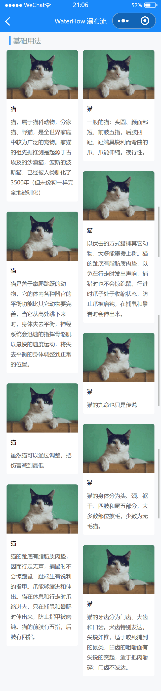

# WaterFlow 瀑布流

---

 <div class="demo-outer-container">
     <div class="demo-inner-container">
        <div class="demo-content">
            
        </div>
     </div>
 </div>

## 引入

在 app.json 或 index.json 中引入组件，详细介绍见[快速上手](/#/start)

```json
"usingComponents": {
  "lin-water-flow": "/dist/WaterFlow/index",
  "lin-water-flow-item": "/dist/WaterFlowItem/index"
}
```

## 基础用法

:::demo

```html
<lin-water-flow watchData="{ {dataList}}">
  <lin-water-flow-item wx:for="{ {dataList}}" wx:key="index">
    <view class="water-flow-item-wrapper">
      <image mode="widthFix" class="image" src="{ {item.image}}"></image>
      <view class="title">{ {item.title}}</view>
      <view class="describe">{ {item.describe}}</view>
    </view>
  </lin-water-flow-item>
</lin-water-flow>
```

```javascript
Page({
  data: {
    dataList: [
      {
        image: "/images/cat.png",
        title: "猫",
        describe:
          "猫，属于猫科动物，分家猫、野猫，是全世界家庭中较为广泛的宠物。家猫的祖先据推测是起源于古埃及的沙漠猫，波斯的波斯猫，已经被人类驯化了3500年（但未像狗一样完全地被驯化）",
      },
      {
        image: "/images/cat.png",
        title: "猫",
        describe:
          "一般的猫：头圆、颜面部短，前肢五指，后肢四趾，趾端具锐利而弯曲的爪，爪能伸缩。夜行性。",
      },
      {
        image: "/images/cat.png",
        title: "猫",
        describe:
          "以伏击的方式猎捕其它动物，大多能攀援上树。猫的趾底有脂肪质肉垫，以免在行走时发出声响，捕猎时也不会惊跑鼠。行进时爪子处于收缩状态，防止爪被磨钝，在捕鼠和攀岩时会伸出来。",
      },
      {
        image: "/images/cat.png",
        title: "猫",
        describe:
          "猫是善于攀爬跳跃的动物，它的体内各种器官的平衡功能比其它动物要完善，当它从高处跳下来时，身体失去平衡，神经系统会迅速的指挥骨骼肌以最快的速度运动，将失去平衡的身体调整到正常的位置。",
      },
      {
        image: "/images/cat.png",
        title: "猫",
        describe: "猫的九命也只是传说",
      },
      {
        image: "/images/cat.png",
        title: "猫",
        describe: "虽然猫可以通过调整，把伤害减到最低",
      },
      {
        image: "/images/cat.png",
        title: "猫",
        describe:
          "猫的身体分为头、颈、躯干、四肢和尾五部分，大多数部位披毛，少数为无毛猫。",
      },
      {
        image: "/images/cat.png",
        title: "猫",
        describe:
          "猫的趾底有脂肪质肉垫，因而行走无声，捕鼠时不会惊跑鼠，趾端生有锐利的指甲。爪能够缩进和伸出。猫在休息和行走时爪缩进去，只在捕鼠和攀爬时伸出来，防止指甲被磨钝。猫的前肢有五指，后肢有四指。",
      },
      {
        image: "/images/cat.png",
        title: "猫",
        describe:
          "猫的牙齿分为门齿、犬齿和臼齿。犬齿特别发达，尖锐如锥，适于咬死捕到的鼠类，臼齿的咀嚼面有尖锐的突起，适于把肉嚼碎；门齿不发达。",
      },
    ],
  },
});
```

```css
.water-flow-item-wrapper {
  border-radius: 10rpx;
  overflow: hidden;
  font-size: 26rpx;
  background-color: #ffffff;
}

.image {
  width: 100%;
}

.title {
  font-weight: 500;
  line-height: 16px;
  padding: 20rpx;
}

.describe {
  color: #646566;
  line-height: 20px;
  padding: 20rpx;
  padding-top: 0;
}
```

:::

## WaterFlow 属性

| 参数             | 说明                                             | 类型   | 可选值 | 默认值 |
| ---------------- | ------------------------------------------------ | ------ | ------ | ------ |
| watchData        | 需要监听的数据变化，数据变化的时候会自动进行排版 | Array  | —      | —      |
| verticalMargin   | 垂直边距                                         | Number | —      | 20     |
| horizontalMargin | 水平边距                                         | Number | —      | 10     |

## WaterFlow 外部样式类

| 插槽名称     | 说明         |
| ------------ | ------------ |
| custom-class | 根节点样式类 |

## WaterFlow 方法

通过 selectComponent 可以获取到 WaterFlow 实例并调用实例方法

| 方法名          | 参数 | 返回值 | 介绍       |
| --------------- | ---- | ------ | ---------- |
| renderWaterFlow | —    | void   | 渲染瀑布流 |

## WaterFlowItem 外部样式类

| 插槽名称     | 说明         |
| ------------ | ------------ |
| custom-class | 根节点样式类 |

## 关于watchData

`watchData`是用来通知组件你的数据发生了变化，组件内部会自动进行排版渲染。如果你的数据层次太深或者你没有传入`watchData`，组件内部监听不到`watchData`的数据变化，这个时候你就需要获取`WaterFlow`组件的实例，然后调用`renderWaterFlow`方法，手动进行排版渲染
